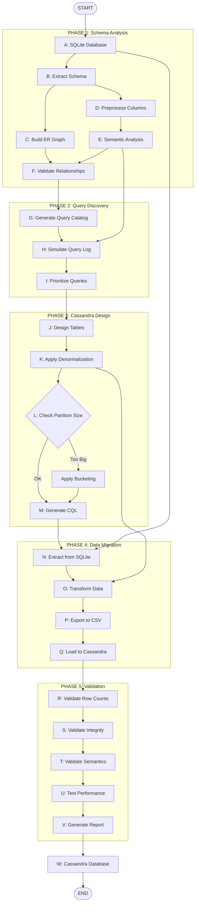
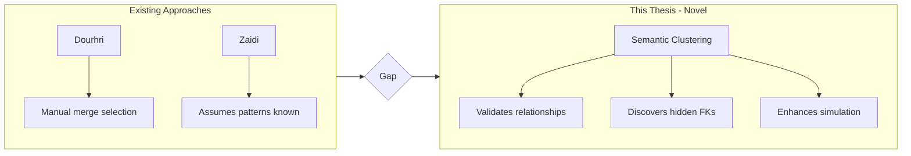
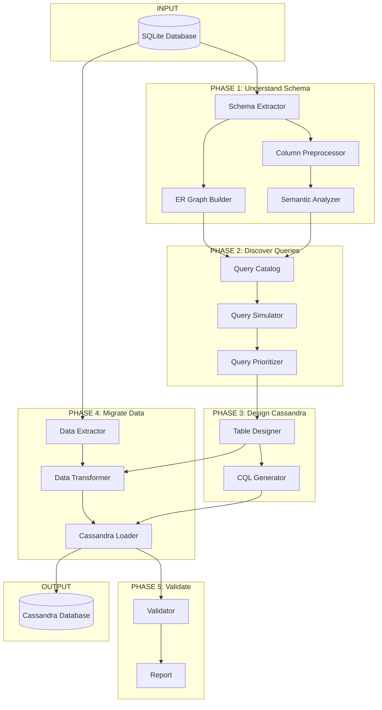
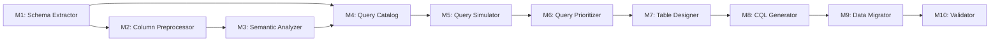
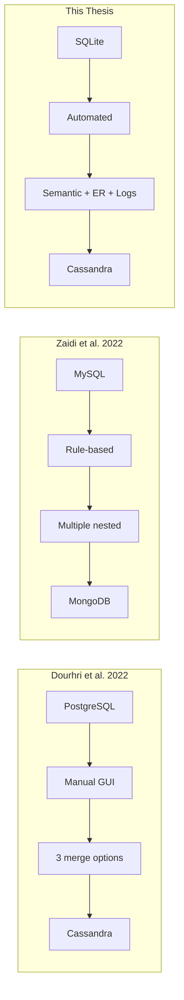

# SQLite to Cassandra Migration Methodology
## Master Thesis Plan (Version 2.0)

---

## 1. Thesis Overview

### 1.1 Title
**"A Hybrid Semantic and Query-Driven Methodology for Automated Migration from Relational Databases to Apache Cassandra"**

### 1.2 Problem Statement
Organizations need to migrate from relational databases (SQLite) to NoSQL databases (Cassandra) for scalability. Current approaches either:
- Require **manual decisions** (Dourhri et al.)
- Assume **query patterns are known** (Zaidi et al.)
- **Ignore semantic relationships** between columns

### 1.3 Proposed Solution
A **hybrid automated approach** that combines:

```
┌─────────────────────────────────────────────────────────────────┐
│                    THREE-PILLAR APPROACH                        │
├─────────────────────┬─────────────────────┬─────────────────────┤
│   ER-Based Analysis │ Semantic Clustering │  Query Simulation   │
│      (Primary)      │    (Validation)     │   (Prioritization)  │
├─────────────────────┼─────────────────────┼─────────────────────┤
│ • Extract FK        │ • Validate FKs      │ • Generate logs     │
│ • Build graph       │ • Discover implicit │ • Estimate frequency│
│ • Detect patterns   │ • Handle missing FK │ • Prioritize queries│
└─────────────────────┴─────────────────────┴─────────────────────┘
```

---

## 1.4 Complete Migration Flowchart (A to Z)

### Overview: The Complete Journey

```
┌─────────────────────────────────────────────────────────────────────────────┐
│                                                                             │
│   START                                                                     │
│     │                                                                       │
│     ▼                                                                       │
│   ┌─────────────────────────────────────────────────────────────────────┐  │
│   │  A. INPUT: SQLite Database (chinook.db)                             │  │
│   └─────────────────────────────────────────────────────────────────────┘  │
│     │                                                                       │
│     ▼                                                                       │
│   ══════════════════════════════════════════════════════════════════════   │
│   ║                    PHASE 1: SCHEMA ANALYSIS                        ║   │
│   ══════════════════════════════════════════════════════════════════════   │
│     │                                                                       │
│     ▼                                                                       │
│   ┌─────────────────────────────────────────────────────────────────────┐  │
│   │  B. Extract Schema Metadata                                         │  │
│   │     • Tables, columns, data types                                   │  │
│   │     • Foreign key relationships                                     │  │
│   │     • Row counts                                                    │  │
│   └─────────────────────────────────────────────────────────────────────┘  │
│     │                                                                       │
│     ▼                                                                       │
│   ┌─────────────────────────────────────────────────────────────────────┐  │
│   │  C. Build ER Graph                                                  │  │
│   │     • Nodes = Tables                                                │  │
│   │     • Edges = FK Relationships                                      │  │
│   │     • Detect: 1:1, 1:N, M:N patterns                               │  │
│   └─────────────────────────────────────────────────────────────────────┘  │
│     │                                                                       │
│     ▼                                                                       │
│   ┌─────────────────────────────────────────────────────────────────────┐  │
│   │  D. Preprocess Column Names                                         │  │
│   │     • Expand abbreviations (cust → customer)                        │  │
│   │     • Add table context (id → customer_id)                          │  │
│   │     • Flag cryptic names                                            │  │
│   └─────────────────────────────────────────────────────────────────────┘  │
│     │                                                                       │
│     ▼                                                                       │
│   ┌─────────────────────────────────────────────────────────────────────┐  │
│   │  E. Semantic Analysis                                               │  │
│   │     • Generate embeddings (SentenceTransformer)                     │  │
│   │     • Cluster columns (K-Means)                                     │  │
│   │     • Compare clusters vs FKs (validation)                          │  │
│   │     • Calculate: Precision, Recall, F1                              │  │
│   └─────────────────────────────────────────────────────────────────────┘  │
│     │                                                                       │
│     ▼                                                                       │
│   ┌─────────────────────────────────────────────────────────────────────┐  │
│   │  F. Merge & Validate Relationships                                  │  │
│   │     • Confirmed FKs (semantic agrees)                               │  │
│   │     • Discovered relationships (semantic finds new)                 │  │
│   │     • Flagged discrepancies (review needed)                         │  │
│   └─────────────────────────────────────────────────────────────────────┘  │
│     │                                                                       │
│     ▼                                                                       │
│   ══════════════════════════════════════════════════════════════════════   │
│   ║                   PHASE 2: QUERY DISCOVERY                         ║   │
│   ══════════════════════════════════════════════════════════════════════   │
│     │                                                                       │
│     ▼                                                                       │
│   ┌─────────────────────────────────────────────────────────────────────┐  │
│   │  G. Generate Query Catalog                                          │  │
│   │     • PK lookups: get_X_by_id                                       │  │
│   │     • FK traversals: get_children_by_parent                         │  │
│   │     • M:N queries: get_X_by_Y_through_junction                      │  │
│   │     • Range queries: get_X_by_date_range                            │  │
│   │     • Aggregations: count_X_by_Y                                    │  │
│   └─────────────────────────────────────────────────────────────────────┘  │
│     │                                                                       │
│     ▼                                                                       │
│   ┌─────────────────────────────────────────────────────────────────────┐  │
│   │  H. Simulate Query Log                                              │  │
│   │     • Assign base frequency by query type                           │  │
│   │     • Apply semantic boost (columns in same cluster)                │  │
│   │     • Apply domain boost (temporal, ID columns)                     │  │
│   │     • Generate 10,000+ log entries                                  │  │
│   └─────────────────────────────────────────────────────────────────────┘  │
│     │                                                                       │
│     ▼                                                                       │
│   ┌─────────────────────────────────────────────────────────────────────┐  │
│   │  I. Prioritize Queries                                              │  │
│   │     • Count frequency of each pattern                               │  │
│   │     • Classify:                                                     │  │
│   │       - HIGH (>10%) → Dedicated table                               │  │
│   │       - MEDIUM (2-10%) → Table or index                             │  │
│   │       - LOW (<2%) → Index or skip                                   │  │
│   └─────────────────────────────────────────────────────────────────────┘  │
│     │                                                                       │
│     ▼                                                                       │
│   ══════════════════════════════════════════════════════════════════════   │
│   ║                  PHASE 3: CASSANDRA DESIGN                         ║   │
│   ══════════════════════════════════════════════════════════════════════   │
│     │                                                                       │
│     ▼                                                                       │
│   ┌─────────────────────────────────────────────────────────────────────┐  │
│   │  J. Design Tables (for each HIGH priority query)                    │  │
│   │     • Partition key = WHERE clause column                           │  │
│   │     • Clustering key = ORDER BY column                              │  │
│   │     • Include all SELECT columns                                    │  │
│   └─────────────────────────────────────────────────────────────────────┘  │
│     │                                                                       │
│     ▼                                                                       │
│   ┌─────────────────────────────────────────────────────────────────────┐  │
│   │  K. Apply Denormalization                                           │  │
│   │     • 1:1 → Merge tables                                            │  │
│   │     • 1:N → Parent as partition key                                 │  │
│   │     • M:N → Create two tables (one per direction)                   │  │
│   │     • Embed frequently accessed parent columns                      │  │
│   └─────────────────────────────────────────────────────────────────────┘  │
│     │                                                                       │
│     ▼                                                                       │
│   ┌─────────────────────────────────────────────────────────────────────┐  │
│   │  L. Estimate Partition Sizes                                        │  │
│   │     • Calculate: rows_per_partition × row_size                      │  │
│   │     • Check against 100MB limit                                     │  │
│   └─────────────────────────────────────────────────────────────────────┘  │
│     │                                                                       │
│     ├──────────────────────────────┐                                       │
│     ▼                              ▼                                       │
│   ┌─────────────────┐    ┌─────────────────────────────────────────────┐  │
│   │ Size OK (<100MB)│    │ Size TOO BIG (>100MB)                       │  │
│   │ Continue...     │    │ Apply bucketing:                            │  │
│   └────────┬────────┘    │   • Time-based (year/month)                 │  │
│            │             │   • Count-based (bucket_id)                 │  │
│            │             └──────────────────┬──────────────────────────┘  │
│            │                                │                              │
│            ◄────────────────────────────────┘                              │
│     │                                                                       │
│     ▼                                                                       │
│   ┌─────────────────────────────────────────────────────────────────────┐  │
│   │  M. Generate CQL Schema                                             │  │
│   │     • CREATE KEYSPACE statement                                     │  │
│   │     • CREATE TABLE statements                                       │  │
│   │     • CREATE INDEX for secondary patterns                           │  │
│   │     • Map data types (SQLite → CQL)                                 │  │
│   └─────────────────────────────────────────────────────────────────────┘  │
│     │                                                                       │
│     ▼                                                                       │
│   ══════════════════════════════════════════════════════════════════════   │
│   ║                   PHASE 4: DATA MIGRATION                          ║   │
│   ══════════════════════════════════════════════════════════════════════   │
│     │                                                                       │
│     ▼                                                                       │
│   ┌─────────────────────────────────────────────────────────────────────┐  │
│   │  N. Extract Data from SQLite                                        │  │
│   │     • Read tables using pandas                                      │  │
│   │     • Preserve data types                                           │  │
│   └─────────────────────────────────────────────────────────────────────┘  │
│     │                                                                       │
│     ▼                                                                       │
│   ┌─────────────────────────────────────────────────────────────────────┐  │
│   │  O. Transform Data                                                  │  │
│   │     • JOIN tables for denormalization                               │  │
│   │     • Rename columns to match Cassandra schema                      │  │
│   │     • Handle NULL values                                            │  │
│   │     • Convert data types                                            │  │
│   └─────────────────────────────────────────────────────────────────────┘  │
│     │                                                                       │
│     ▼                                                                       │
│   ┌─────────────────────────────────────────────────────────────────────┐  │
│   │  P. Export to CSV                                                   │  │
│   │     • One CSV file per Cassandra table                              │  │
│   │     • Include headers                                               │  │
│   └─────────────────────────────────────────────────────────────────────┘  │
│     │                                                                       │
│     ▼                                                                       │
│   ┌─────────────────────────────────────────────────────────────────────┐  │
│   │  Q. Load into Cassandra                                             │  │
│   │     • Execute CQL schema                                            │  │
│   │     • Use dsbulk to load CSV files                                  │  │
│   │     • Verify load success                                           │  │
│   └─────────────────────────────────────────────────────────────────────┘  │
│     │                                                                       │
│     ▼                                                                       │
│   ══════════════════════════════════════════════════════════════════════   │
│   ║                    PHASE 5: VALIDATION                             ║   │
│   ══════════════════════════════════════════════════════════════════════   │
│     │                                                                       │
│     ▼                                                                       │
│   ┌─────────────────────────────────────────────────────────────────────┐  │
│   │  R. Validate Row Counts                                             │  │
│   │     • Compare source vs target                                      │  │
│   │     • Account for denormalization multiplier                        │  │
│   └─────────────────────────────────────────────────────────────────────┘  │
│     │                                                                       │
│     ▼                                                                       │
│   ┌─────────────────────────────────────────────────────────────────────┐  │
│   │  S. Validate Data Integrity                                         │  │
│   │     • Random sample 100-1000 rows                                   │  │
│   │     • Compare field values                                          │  │
│   └─────────────────────────────────────────────────────────────────────┘  │
│     │                                                                       │
│     ▼                                                                       │
│   ┌─────────────────────────────────────────────────────────────────────┐  │
│   │  T. Validate Semantic Accuracy                                      │  │
│   │     • Compare semantic clusters vs FK ground truth                  │  │
│   │     • Calculate Precision, Recall, F1-score                         │  │
│   │     • Target: F1 > 0.85                                             │  │
│   └─────────────────────────────────────────────────────────────────────┘  │
│     │                                                                       │
│     ▼                                                                       │
│   ┌─────────────────────────────────────────────────────────────────────┐  │
│   │  U. Test Query Performance                                          │  │
│   │     • Execute benchmark queries                                     │  │
│   │     • Measure latency (p50, p99)                                    │  │
│   │     • Compare SQLite vs Cassandra                                   │  │
│   └─────────────────────────────────────────────────────────────────────┘  │
│     │                                                                       │
│     ▼                                                                       │
│   ┌─────────────────────────────────────────────────────────────────────┐  │
│   │  V. Generate Validation Report                                      │  │
│   │     • Summary of all checks                                         │  │
│   │     • Pass/Fail status                                              │  │
│   │     • Recommendations                                               │  │
│   └─────────────────────────────────────────────────────────────────────┘  │
│     │                                                                       │
│     ▼                                                                       │
│   ┌─────────────────────────────────────────────────────────────────────┐  │
│   │  W. OUTPUT: Cassandra Database (Ready for Production)               │  │
│   └─────────────────────────────────────────────────────────────────────┘  │
│     │                                                                       │
│     ▼                                                                       │
│   END                                                                       │
│                                                                             │
└─────────────────────────────────────────────────────────────────────────────┘
```

### Mermaid Flowchart (Interactive Version)



### Step-by-Step Summary Table

| Step | Name | Input | Output | Module |
|------|------|-------|--------|--------|
| **A** | Input Database | - | chinook.db | - |
| **B** | Extract Schema | chinook.db | schema.json | M1 |
| **C** | Build ER Graph | schema.json | er_graph.json | M1 |
| **D** | Preprocess Columns | columns | clean_columns.json | M2 |
| **E** | Semantic Analysis | clean_columns | clusters.json | M3 |
| **F** | Validate Relationships | ER + clusters | validated_rels.json | M3 |
| **G** | Generate Query Catalog | validated_rels | query_catalog.json | M4 |
| **H** | Simulate Query Log | catalog + clusters | query_log.json | M5 |
| **I** | Prioritize Queries | query_log | prioritized.json | M6 |
| **J** | Design Tables | prioritized | table_designs.json | M7 |
| **K** | Apply Denormalization | table_designs | denorm_rules.json | M7 |
| **L** | Check Partition Size | denorm_rules | size_check.json | M7 |
| **M** | Generate CQL | table_designs | schema.cql | M8 |
| **N** | Extract Data | chinook.db | raw_data/ | M9 |
| **O** | Transform Data | raw_data + rules | transformed/ | M9 |
| **P** | Export CSV | transformed | csv_files/ | M9 |
| **Q** | Load to Cassandra | csv + cql | Cassandra DB | M9 |
| **R** | Validate Counts | source + target | count_report | M10 |
| **S** | Validate Integrity | sample rows | integrity_report | M10 |
| **T** | Validate Semantics | clusters vs FKs | semantic_report | M10 |
| **U** | Test Performance | queries | perf_report | M10 |
| **V** | Generate Report | all reports | final_report.json | M10 |
| **W** | Output | - | Cassandra Database | - |

---

## 1.5 Detailed Examples: Phase 1 & Phase 2

### PHASE 1: SCHEMA ANALYSIS - Detailed Example

Using the **Chinook Database** as our example:

#### Step B: Extract Schema Metadata

```
┌─────────────────────────────────────────────────────────────────────────────┐
│  INPUT: chinook.db                                                          │
│                                                                             │
│  SQL Commands Executed:                                                     │
│  ──────────────────────                                                     │
│                                                                             │
│  1. Get tables:                                                             │
│     SELECT name FROM sqlite_master WHERE type='table';                      │
│                                                                             │
│  2. Get columns (for each table):                                           │
│     PRAGMA table_info(albums);                                              │
│                                                                             │
│  3. Get foreign keys (for each table):                                      │
│     PRAGMA foreign_key_list(albums);                                        │
│                                                                             │
│  4. Get row counts:                                                         │
│     SELECT COUNT(*) FROM albums;                                            │
│                                                                             │
└─────────────────────────────────────────────────────────────────────────────┘

┌─────────────────────────────────────────────────────────────────────────────┐
│  OUTPUT: schema.json                                                        │
│                                                                             │
│  {                                                                          │
│    "tables": [                                                              │
│      "albums", "artists", "customers", "employees",                         │
│      "genres", "invoices", "invoice_items", "media_types",                  │
│      "playlists", "playlist_track", "tracks"                                │
│    ],                                                                       │
│                                                                             │
│    "columns": {                                                             │
│      "albums": [                                                            │
│        {"name": "AlbumId", "type": "INTEGER", "pk": true},                  │
│        {"name": "Title", "type": "NVARCHAR(160)"},                          │
│        {"name": "ArtistId", "type": "INTEGER"}                              │
│      ],                                                                     │
│      "artists": [                                                           │
│        {"name": "ArtistId", "type": "INTEGER", "pk": true},                 │
│        {"name": "Name", "type": "NVARCHAR(120)"}                            │
│      ],                                                                     │
│      "tracks": [                                                            │
│        {"name": "TrackId", "type": "INTEGER", "pk": true},                  │
│        {"name": "Name", "type": "NVARCHAR(200)"},                           │
│        {"name": "AlbumId", "type": "INTEGER"},                              │
│        {"name": "MediaTypeId", "type": "INTEGER"},                          │
│        {"name": "GenreId", "type": "INTEGER"},                              │
│        {"name": "Composer", "type": "NVARCHAR(220)"},                       │
│        {"name": "Milliseconds", "type": "INTEGER"},                         │
│        {"name": "Bytes", "type": "INTEGER"},                                │
│        {"name": "UnitPrice", "type": "NUMERIC(10,2)"}                       │
│      ]                                                                      │
│      // ... more tables                                                     │
│    },                                                                       │
│                                                                             │
│    "foreign_keys": [                                                        │
│      {"from": "albums.ArtistId", "to": "artists.ArtistId"},                 │
│      {"from": "tracks.AlbumId", "to": "albums.AlbumId"},                    │
│      {"from": "tracks.GenreId", "to": "genres.GenreId"},                    │
│      {"from": "tracks.MediaTypeId", "to": "media_types.MediaTypeId"},       │
│      {"from": "invoices.CustomerId", "to": "customers.CustomerId"},         │
│      {"from": "invoice_items.InvoiceId", "to": "invoices.InvoiceId"},       │
│      {"from": "invoice_items.TrackId", "to": "tracks.TrackId"},             │
│      {"from": "playlist_track.PlaylistId", "to": "playlists.PlaylistId"},   │
│      {"from": "playlist_track.TrackId", "to": "tracks.TrackId"},            │
│      {"from": "customers.SupportRepId", "to": "employees.EmployeeId"},      │
│      {"from": "employees.ReportsTo", "to": "employees.EmployeeId"}          │
│    ],                                                                       │
│                                                                             │
│    "row_counts": {                                                          │
│      "albums": 347,                                                         │
│      "artists": 275,                                                        │
│      "customers": 59,                                                       │
│      "employees": 8,                                                        │
│      "genres": 25,                                                          │
│      "invoices": 412,                                                       │
│      "invoice_items": 2240,                                                 │
│      "media_types": 5,                                                      │
│      "playlists": 18,                                                       │
│      "playlist_track": 8715,                                                │
│      "tracks": 3503                                                         │
│    }                                                                        │
│  }                                                                          │
│                                                                             │
└─────────────────────────────────────────────────────────────────────────────┘
```

#### Step C: Build ER Graph

```
┌─────────────────────────────────────────────────────────────────────────────┐
│  ER GRAPH VISUALIZATION (Chinook Database)                                  │
│                                                                             │
│                                                                             │
│                        ┌──────────────┐                                     │
│                        │   artists    │                                     │
│                        │──────────────│                                     │
│                        │ • ArtistId   │◄─────────────┐                      │
│                        │ • Name       │              │                      │
│                        └──────────────┘              │                      │
│                               │                      │                      │
│                               │ 1:N                  │                      │
│                               ▼                      │                      │
│                        ┌──────────────┐              │                      │
│                        │   albums     │              │                      │
│                        │──────────────│              │                      │
│                        │ • AlbumId    │◄──────┐      │                      │
│                        │ • Title      │       │      │                      │
│                        │ • ArtistId   │───────┘      │                      │
│                        └──────────────┘              │                      │
│                               │                      │                      │
│                               │ 1:N                  │                      │
│                               ▼                      │                      │
│  ┌──────────────┐      ┌──────────────┐      ┌──────────────┐              │
│  │   genres     │      │   tracks     │      │ media_types  │              │
│  │──────────────│      │──────────────│      │──────────────│              │
│  │ • GenreId    │◄─────│ • TrackId    │─────►│ • MediaTypeId│              │
│  │ • Name       │      │ • Name       │      │ • Name       │              │
│  └──────────────┘      │ • AlbumId    │      └──────────────┘              │
│                        │ • GenreId    │                                     │
│                        │ • Composer   │                                     │
│                        │ • UnitPrice  │                                     │
│                        └──────────────┘                                     │
│                               │                                             │
│                    ┌──────────┴──────────┐                                  │
│                    │                     │                                  │
│                    ▼                     ▼                                  │
│  ┌────────────────────────┐    ┌────────────────────────┐                  │
│  │   playlist_track (M:N) │    │    invoice_items       │                  │
│  │────────────────────────│    │────────────────────────│                  │
│  │ • PlaylistId           │    │ • InvoiceLineId        │                  │
│  │ • TrackId              │    │ • InvoiceId            │                  │
│  └────────────────────────┘    │ • TrackId              │                  │
│             │                  │ • UnitPrice            │                  │
│             │                  │ • Quantity             │                  │
│             ▼                  └────────────────────────┘                  │
│  ┌──────────────┐                        │                                  │
│  │  playlists   │                        │                                  │
│  │──────────────│                        ▼                                  │
│  │ • PlaylistId │              ┌──────────────┐                             │
│  │ • Name       │              │   invoices   │                             │
│  └──────────────┘              │──────────────│                             │
│                                │ • InvoiceId  │                             │
│                                │ • CustomerId │                             │
│                                │ • InvoiceDate│                             │
│                                │ • Total      │                             │
│                                └──────────────┘                             │
│                                       │                                     │
│                                       ▼                                     │
│                                ┌──────────────┐      ┌──────────────┐       │
│                                │  customers   │      │  employees   │       │
│                                │──────────────│      │──────────────│       │
│                                │ • CustomerId │─────►│ • EmployeeId │       │
│                                │ • FirstName  │      │ • LastName   │       │
│                                │ • Email      │      │ • ReportsTo  │◄──┐   │
│                                │ • SupportRep │      │ • ...        │───┘   │
│                                └──────────────┘      └──────────────┘       │
│                                                      (self-reference)       │
│                                                                             │
│  RELATIONSHIP TYPES DETECTED:                                               │
│  ─────────────────────────────                                              │
│  • 1:N (One-to-Many): 9 relationships                                       │
│  • M:N (Many-to-Many): 1 relationship (playlist ↔ track)                    │
│  • Self-referencing: 1 (employees.ReportsTo)                                │
│                                                                             │
└─────────────────────────────────────────────────────────────────────────────┘
```

#### Step D: Preprocess Column Names

```
┌─────────────────────────────────────────────────────────────────────────────┐
│  COLUMN PREPROCESSING EXAMPLES                                              │
│                                                                             │
│  Rule 1: Add table context for generic columns                              │
│  ─────────────────────────────────────────────                              │
│                                                                             │
│    BEFORE                    AFTER                                          │
│    ──────                    ─────                                          │
│    artists.Name         →    artists.artist_name                            │
│    genres.Name          →    genres.genre_name                              │
│    playlists.Name       →    playlists.playlist_name                        │
│    tracks.Name          →    tracks.track_name                              │
│                                                                             │
│  Rule 2: Expand abbreviations (if any)                                      │
│  ─────────────────────────────────────                                      │
│                                                                             │
│    BEFORE                    AFTER                                          │
│    ──────                    ─────                                          │
│    cust_id              →    customer_id                                    │
│    emp_name             →    employee_name                                  │
│    addr                 →    address                                        │
│                                                                             │
│  Rule 3: Keep well-named columns as-is                                      │
│  ─────────────────────────────────────                                      │
│                                                                             │
│    AlbumId              →    AlbumId (unchanged - already descriptive)      │
│    CustomerId           →    CustomerId (unchanged)                         │
│    InvoiceDate          →    InvoiceDate (unchanged)                        │
│                                                                             │
│  OUTPUT: preprocessed_columns.json                                          │
│  {                                                                          │
│    "artists.Name": "artists.artist_name",                                   │
│    "genres.Name": "genres.genre_name",                                      │
│    "tracks.Name": "tracks.track_name",                                      │
│    "albums.Title": "albums.album_title",                                    │
│    ...                                                                      │
│  }                                                                          │
│                                                                             │
└─────────────────────────────────────────────────────────────────────────────┘
```

#### Step E: Semantic Analysis

```
┌─────────────────────────────────────────────────────────────────────────────┐
│  SEMANTIC ANALYSIS PROCESS                                                  │
│                                                                             │
│  Step E.1: Generate Embeddings                                              │
│  ─────────────────────────────                                              │
│                                                                             │
│  Using SentenceTransformer('all-MiniLM-L6-v2'):                             │
│                                                                             │
│  Column Name              →  Embedding Vector (384 dimensions)              │
│  ───────────────────────────────────────────────────────────────            │
│  "albums.AlbumId"         →  [0.023, -0.156, 0.089, ..., 0.045]            │
│  "albums.album_title"     →  [0.112, -0.034, 0.201, ..., -0.067]           │
│  "albums.ArtistId"        →  [0.087, -0.123, 0.045, ..., 0.098]            │
│  "artists.ArtistId"       →  [0.091, -0.119, 0.048, ..., 0.102]  ◄─ Similar│
│  "artists.artist_name"    →  [0.134, -0.045, 0.189, ..., -0.023]           │
│  "tracks.TrackId"         →  [0.056, -0.178, 0.067, ..., 0.134]            │
│  "tracks.AlbumId"         →  [0.084, -0.127, 0.043, ..., 0.095]  ◄─ Similar│
│  ...                                                                        │
│                                                                             │
│  Step E.2: Cluster with K-Means                                             │
│  ──────────────────────────────                                             │
│                                                                             │
│  Finding optimal K using silhouette score:                                  │
│                                                                             │
│  K=5:  silhouette = 0.42                                                    │
│  K=8:  silhouette = 0.51                                                    │
│  K=10: silhouette = 0.58  ◄─ Best                                           │
│  K=12: silhouette = 0.53                                                    │
│  K=15: silhouette = 0.47                                                    │
│                                                                             │
│  Selected: K = 10 clusters                                                  │
│                                                                             │
│  Step E.3: Resulting Clusters                                               │
│  ────────────────────────────                                               │
│                                                                             │
│  ┌─────────────────────────────────────────────────────────────────────┐   │
│  │ Cluster 0: Album/Artist Related                                     │   │
│  │   • albums.AlbumId                                                  │   │
│  │   • albums.album_title                                              │   │
│  │   • albums.ArtistId        ◄─┐                                      │   │
│  │   • artists.ArtistId       ◄─┴─ FK pair in same cluster ✓           │   │
│  │   • artists.artist_name                                             │   │
│  │   • tracks.AlbumId         ◄─── FK to albums in same cluster ✓      │   │
│  └─────────────────────────────────────────────────────────────────────┘   │
│                                                                             │
│  ┌─────────────────────────────────────────────────────────────────────┐   │
│  │ Cluster 1: Customer/Invoice Related                                 │   │
│  │   • customers.CustomerId   ◄─┐                                      │   │
│  │   • customers.FirstName      │                                      │   │
│  │   • customers.Email          │                                      │   │
│  │   • invoices.CustomerId    ◄─┴─ FK pair in same cluster ✓           │   │
│  │   • invoices.InvoiceId                                              │   │
│  │   • invoices.Total                                                  │   │
│  └─────────────────────────────────────────────────────────────────────┘   │
│                                                                             │
│  ┌─────────────────────────────────────────────────────────────────────┐   │
│  │ Cluster 2: Track Details                                            │   │
│  │   • tracks.TrackId                                                  │   │
│  │   • tracks.track_name                                               │   │
│  │   • tracks.Composer                                                 │   │
│  │   • tracks.Milliseconds                                             │   │
│  │   • tracks.Bytes                                                    │   │
│  │   • tracks.UnitPrice                                                │   │
│  └─────────────────────────────────────────────────────────────────────┘   │
│                                                                             │
│  ┌─────────────────────────────────────────────────────────────────────┐   │
│  │ Cluster 3: Genre/MediaType Related                                  │   │
│  │   • genres.GenreId         ◄─┐                                      │   │
│  │   • genres.genre_name        │                                      │   │
│  │   • tracks.GenreId         ◄─┴─ FK pair in same cluster ✓           │   │
│  │   • media_types.MediaTypeId                                         │   │
│  │   • tracks.MediaTypeId     ◄─── FK pair in same cluster ✓           │   │
│  └─────────────────────────────────────────────────────────────────────┘   │
│                                                                             │
│  ┌─────────────────────────────────────────────────────────────────────┐   │
│  │ Cluster 4: Playlist Related                                         │   │
│  │   • playlists.PlaylistId   ◄─┐                                      │   │
│  │   • playlists.playlist_name  │                                      │   │
│  │   • playlist_track.PlaylistId◄┴─ FK pair in same cluster ✓          │   │
│  │   • playlist_track.TrackId                                          │   │
│  └─────────────────────────────────────────────────────────────────────┘   │
│                                                                             │
│  ... (more clusters)                                                        │
│                                                                             │
└─────────────────────────────────────────────────────────────────────────────┘
```

#### Step F: Validate Relationships

```
┌─────────────────────────────────────────────────────────────────────────────┐
│  VALIDATION: Semantic Clusters vs FK Ground Truth                           │
│                                                                             │
│  Ground Truth (11 FK Relationships):                                        │
│  ───────────────────────────────────                                        │
│                                                                             │
│   #  │ FK Relationship                    │ Semantic │ Status              │
│  ────┼────────────────────────────────────┼──────────┼─────────────────────│
│   1  │ albums.ArtistId → artists.ArtistId │ Cluster 0│ ✓ VALIDATED         │
│   2  │ tracks.AlbumId → albums.AlbumId    │ Cluster 0│ ✓ VALIDATED         │
│   3  │ tracks.GenreId → genres.GenreId    │ Cluster 3│ ✓ VALIDATED         │
│   4  │ tracks.MediaTypeId → media_types   │ Cluster 3│ ✓ VALIDATED         │
│   5  │ invoices.CustomerId → customers    │ Cluster 1│ ✓ VALIDATED         │
│   6  │ invoice_items.InvoiceId → invoices │ Cluster 5│ ✓ VALIDATED         │
│   7  │ invoice_items.TrackId → tracks     │ Cluster 2│ ✗ DIFFERENT CLUSTER │
│   8  │ playlist_track.PlaylistId → ...    │ Cluster 4│ ✓ VALIDATED         │
│   9  │ playlist_track.TrackId → tracks    │ Cluster 4│ ✗ DIFFERENT CLUSTER │
│  10  │ customers.SupportRepId → employees │ Cluster 6│ ✓ VALIDATED         │
│  11  │ employees.ReportsTo → employees    │ Cluster 6│ ✓ VALIDATED         │
│  ────┴────────────────────────────────────┴──────────┴─────────────────────│
│                                                                             │
│  METRICS CALCULATION:                                                       │
│  ────────────────────                                                       │
│                                                                             │
│  True Positives (FK pairs in same cluster):  9                              │
│  False Negatives (FK pairs in different):    2                              │
│  Total FK Relationships:                     11                             │
│                                                                             │
│  Precision = TP / (TP + FP) = 9 / 9 = 1.00                                 │
│  Recall    = TP / (TP + FN) = 9 / 11 = 0.82                                │
│  F1-Score  = 2 × (P × R) / (P + R) = 0.90                                  │
│                                                                             │
│  Result: F1 = 0.90 > 0.85 threshold ✓ PASS                                 │
│                                                                             │
│  DISCOVERED RELATIONSHIPS (Semantic finds but no FK):                       │
│  ─────────────────────────────────────────────────────                      │
│                                                                             │
│  Cluster analysis found these columns cluster together                      │
│  but have no FK constraint (potential implicit relationships):              │
│                                                                             │
│  • tracks.UnitPrice ↔ invoice_items.UnitPrice                              │
│    (Same price stored in both - possible denormalization candidate)        │
│                                                                             │
└─────────────────────────────────────────────────────────────────────────────┘
```

---

### PHASE 2: QUERY DISCOVERY - Detailed Example

#### Step G: Generate Query Catalog

```
┌─────────────────────────────────────────────────────────────────────────────┐
│  QUERY CATALOG GENERATION                                                   │
│                                                                             │
│  For each relationship, generate query patterns:                            │
│                                                                             │
│  ═══════════════════════════════════════════════════════════════════════   │
│  RELATIONSHIP: artists (1) ──► albums (N)                                   │
│  ═══════════════════════════════════════════════════════════════════════   │
│                                                                             │
│  Generated Queries:                                                         │
│  ┌─────────────────────────────────────────────────────────────────────┐   │
│  │ Query ID: Q001                                                      │   │
│  │ Type: PK_LOOKUP                                                     │   │
│  │ Description: "Get artist by ID"                                     │   │
│  │ SQL: SELECT * FROM artists WHERE ArtistId = ?                       │   │
│  │ Filter Column: ArtistId                                             │   │
│  │ Tables: [artists]                                                   │   │
│  └─────────────────────────────────────────────────────────────────────┘   │
│                                                                             │
│  ┌─────────────────────────────────────────────────────────────────────┐   │
│  │ Query ID: Q002                                                      │   │
│  │ Type: FK_TRAVERSAL_1N                                               │   │
│  │ Description: "Get albums by artist"                                 │   │
│  │ SQL: SELECT * FROM albums WHERE ArtistId = ?                        │   │
│  │ Filter Column: ArtistId                                             │   │
│  │ Tables: [albums]                                                    │   │
│  │ Denormalize From: [artists]                                         │   │
│  └─────────────────────────────────────────────────────────────────────┘   │
│                                                                             │
│  ═══════════════════════════════════════════════════════════════════════   │
│  RELATIONSHIP: albums (1) ──► tracks (N)                                    │
│  ═══════════════════════════════════════════════════════════════════════   │
│                                                                             │
│  ┌─────────────────────────────────────────────────────────────────────┐   │
│  │ Query ID: Q003                                                      │   │
│  │ Type: FK_TRAVERSAL_1N                                               │   │
│  │ Description: "Get tracks by album"                                  │   │
│  │ SQL: SELECT * FROM tracks WHERE AlbumId = ?                         │   │
│  │ Filter Column: AlbumId                                              │   │
│  │ Tables: [tracks]                                                    │   │
│  │ Denormalize From: [albums, artists]                                 │   │
│  └─────────────────────────────────────────────────────────────────────┘   │
│                                                                             │
│  ═══════════════════════════════════════════════════════════════════════   │
│  RELATIONSHIP: playlists (M) ◄──► tracks (N) via playlist_track            │
│  ═══════════════════════════════════════════════════════════════════════   │
│                                                                             │
│  ┌─────────────────────────────────────────────────────────────────────┐   │
│  │ Query ID: Q010                                                      │   │
│  │ Type: MN_TRAVERSAL                                                  │   │
│  │ Description: "Get tracks by playlist"                               │   │
│  │ SQL: SELECT t.* FROM tracks t                                       │   │
│  │      JOIN playlist_track pt ON t.TrackId = pt.TrackId               │   │
│  │      WHERE pt.PlaylistId = ?                                        │   │
│  │ Filter Column: PlaylistId                                           │   │
│  │ Tables: [tracks, playlist_track]                                    │   │
│  │ Denormalize From: [playlists]                                       │   │
│  └─────────────────────────────────────────────────────────────────────┘   │
│                                                                             │
│  ┌─────────────────────────────────────────────────────────────────────┐   │
│  │ Query ID: Q011                                                      │   │
│  │ Type: MN_TRAVERSAL                                                  │   │
│  │ Description: "Get playlists by track"                               │   │
│  │ SQL: SELECT p.* FROM playlists p                                    │   │
│  │      JOIN playlist_track pt ON p.PlaylistId = pt.PlaylistId         │   │
│  │      WHERE pt.TrackId = ?                                           │   │
│  │ Filter Column: TrackId                                              │   │
│  │ Tables: [playlists, playlist_track]                                 │   │
│  │ Denormalize From: [tracks]                                          │   │
│  └─────────────────────────────────────────────────────────────────────┘   │
│                                                                             │
│  ═══════════════════════════════════════════════════════════════════════   │
│  ADDITIONAL QUERY TYPES                                                     │
│  ═══════════════════════════════════════════════════════════════════════   │
│                                                                             │
│  ┌─────────────────────────────────────────────────────────────────────┐   │
│  │ Query ID: Q020                                                      │   │
│  │ Type: RANGE_QUERY                                                   │   │
│  │ Description: "Get invoices by date range"                           │   │
│  │ SQL: SELECT * FROM invoices                                         │   │
│  │      WHERE InvoiceDate BETWEEN ? AND ?                              │   │
│  │ Filter Column: InvoiceDate                                          │   │
│  │ Tables: [invoices]                                                  │   │
│  └─────────────────────────────────────────────────────────────────────┘   │
│                                                                             │
│  ┌─────────────────────────────────────────────────────────────────────┐   │
│  │ Query ID: Q021                                                      │   │
│  │ Type: AGGREGATION                                                   │   │
│  │ Description: "Count tracks by genre"                                │   │
│  │ SQL: SELECT GenreId, COUNT(*) FROM tracks GROUP BY GenreId          │   │
│  │ Group Column: GenreId                                               │   │
│  │ Tables: [tracks]                                                    │   │
│  └─────────────────────────────────────────────────────────────────────┘   │
│                                                                             │
│  COMPLETE CATALOG SUMMARY:                                                  │
│  ─────────────────────────                                                  │
│  Total Queries Generated: 25                                                │
│    • PK Lookups: 11                                                         │
│    • FK Traversals (1:N): 9                                                 │
│    • M:N Traversals: 2                                                      │
│    • Range Queries: 2                                                       │
│    • Aggregations: 1                                                        │
│                                                                             │
└─────────────────────────────────────────────────────────────────────────────┘
```

#### Step H: Simulate Query Log (DETAILED)

```
┌─────────────────────────────────────────────────────────────────────────────┐
│  QUERY LOG SIMULATION - DETAILED ALGORITHM                                  │
│                                                                             │
│  ═══════════════════════════════════════════════════════════════════════   │
│  STEP H.1: Assign Base Frequency by Query Type                              │
│  ═══════════════════════════════════════════════════════════════════════   │
│                                                                             │
│  Base frequency represents typical usage patterns:                          │
│                                                                             │
│  ┌──────────────────────────────────────────────────────────────────────┐  │
│  │ Query Type          │ Base Frequency │ Reasoning                     │  │
│  ├──────────────────────────────────────────────────────────────────────┤  │
│  │ FK_TRAVERSAL_1N     │ 0.20 (20%)     │ Most common: "show children"  │  │
│  │ MN_TRAVERSAL        │ 0.12 (12%)     │ Common: playlist browsing     │  │
│  │ PK_LOOKUP           │ 0.08 (8%)      │ Direct access by ID           │  │
│  │ RANGE_QUERY         │ 0.05 (5%)      │ Date-based filtering          │  │
│  │ AGGREGATION         │ 0.03 (3%)      │ Analytics, less frequent      │  │
│  └──────────────────────────────────────────────────────────────────────┘  │
│                                                                             │
│  ═══════════════════════════════════════════════════════════════════════   │
│  STEP H.2: Apply Semantic Boost                                             │
│  ═══════════════════════════════════════════════════════════════════════   │
│                                                                             │
│  If query columns are in the SAME semantic cluster → boost by 10%           │
│                                                                             │
│  Example:                                                                   │
│  ┌──────────────────────────────────────────────────────────────────────┐  │
│  │ Query: "Get albums by artist"                                        │  │
│  │                                                                      │  │
│  │ Columns involved:                                                    │  │
│  │   • albums.ArtistId (Cluster 0)                                      │  │
│  │   • artists.ArtistId (Cluster 0)                                     │  │
│  │                                                                      │  │
│  │ Same cluster? YES → semantic_boost = 1.10                            │  │
│  └──────────────────────────────────────────────────────────────────────┘  │
│                                                                             │
│  ┌──────────────────────────────────────────────────────────────────────┐  │
│  │ Query: "Get invoice items by track"                                  │  │
│  │                                                                      │  │
│  │ Columns involved:                                                    │  │
│  │   • invoice_items.TrackId (Cluster 5)                                │  │
│  │   • tracks.TrackId (Cluster 2)                                       │  │
│  │                                                                      │  │
│  │ Same cluster? NO → semantic_boost = 1.00 (no boost)                  │  │
│  └──────────────────────────────────────────────────────────────────────┘  │
│                                                                             │
│  ═══════════════════════════════════════════════════════════════════════   │
│  STEP H.3: Apply Domain Boost                                               │
│  ═══════════════════════════════════════════════════════════════════════   │
│                                                                             │
│  Certain column types are queried more frequently:                          │
│                                                                             │
│  ┌──────────────────────────────────────────────────────────────────────┐  │
│  │ Column Type           │ Domain Boost │ Reasoning                     │  │
│  ├──────────────────────────────────────────────────────────────────────┤  │
│  │ Temporal (Date/Time)  │ 1.20         │ Time-based queries common     │  │
│  │ ID columns            │ 1.15         │ Primary access pattern        │  │
│  │ Name/Title columns    │ 1.10         │ Display fields                │  │
│  │ Other columns         │ 1.00         │ No boost                      │  │
│  └──────────────────────────────────────────────────────────────────────┘  │
│                                                                             │
│  ═══════════════════════════════════════════════════════════════════════   │
│  STEP H.4: Calculate Final Frequency                                        │
│  ═══════════════════════════════════════════════════════════════════════   │
│                                                                             │
│  Formula: final_freq = base_freq × semantic_boost × domain_boost            │
│                                                                             │
│  EXAMPLE CALCULATIONS:                                                      │
│                                                                             │
│  ┌──────────────────────────────────────────────────────────────────────┐  │
│  │ Query: "Get tracks by album" (Q003)                                  │  │
│  │                                                                      │  │
│  │ base_freq      = 0.20 (FK_TRAVERSAL_1N)                              │  │
│  │ semantic_boost = 1.10 (AlbumId columns in same cluster)              │  │
│  │ domain_boost   = 1.15 (AlbumId is an ID column)                      │  │
│  │                                                                      │  │
│  │ final_freq = 0.20 × 1.10 × 1.15 = 0.253 (25.3%)                      │  │
│  └──────────────────────────────────────────────────────────────────────┘  │
│                                                                             │
│  ┌──────────────────────────────────────────────────────────────────────┐  │
│  │ Query: "Get albums by artist" (Q002)                                 │  │
│  │                                                                      │  │
│  │ base_freq      = 0.20 (FK_TRAVERSAL_1N)                              │  │
│  │ semantic_boost = 1.10 (ArtistId columns in same cluster)             │  │
│  │ domain_boost   = 1.15 (ArtistId is an ID column)                     │  │
│  │                                                                      │  │
│  │ final_freq = 0.20 × 1.10 × 1.15 = 0.253 (25.3%)                      │  │
│  └──────────────────────────────────────────────────────────────────────┘  │
│                                                                             │
│  ┌──────────────────────────────────────────────────────────────────────┐  │
│  │ Query: "Get invoices by date range" (Q020)                           │  │
│  │                                                                      │  │
│  │ base_freq      = 0.05 (RANGE_QUERY)                                  │  │
│  │ semantic_boost = 1.00 (single table, N/A)                            │  │
│  │ domain_boost   = 1.20 (InvoiceDate is temporal)                      │  │
│  │                                                                      │  │
│  │ final_freq = 0.05 × 1.00 × 1.20 = 0.060 (6.0%)                       │  │
│  └──────────────────────────────────────────────────────────────────────┘  │
│                                                                             │
│  ┌──────────────────────────────────────────────────────────────────────┐  │
│  │ Query: "Get invoice items by track" (low semantic)                   │  │
│  │                                                                      │  │
│  │ base_freq      = 0.20 (FK_TRAVERSAL_1N)                              │  │
│  │ semantic_boost = 1.00 (columns in DIFFERENT clusters)                │  │
│  │ domain_boost   = 1.15 (TrackId is an ID column)                      │  │
│  │                                                                      │  │
│  │ final_freq = 0.20 × 1.00 × 1.15 = 0.230 (23.0%)                      │  │
│  │                                                                      │  │
│  │ Note: Lower than "tracks by album" because no semantic boost         │  │
│  └──────────────────────────────────────────────────────────────────────┘  │
│                                                                             │
│  ═══════════════════════════════════════════════════════════════════════   │
│  STEP H.5: Generate 10,000 Log Entries                                      │
│  ═══════════════════════════════════════════════════════════════════════   │
│                                                                             │
│  Using weighted random selection based on final frequencies:                │
│                                                                             │
│  simulated_query_log.json (sample entries):                                 │
│  ┌──────────────────────────────────────────────────────────────────────┐  │
│  │ [                                                                    │  │
│  │   {                                                                  │  │
│  │     "timestamp": "2024-01-15T10:23:45",                              │  │
│  │     "query_id": "Q003",                                              │  │
│  │     "query_type": "FK_TRAVERSAL_1N",                                 │  │
│  │     "description": "Get tracks by album",                            │  │
│  │     "filter_column": "AlbumId",                                      │  │
│  │     "filter_value": 42                                               │  │
│  │   },                                                                 │  │
│  │   {                                                                  │  │
│  │     "timestamp": "2024-01-15T10:23:46",                              │  │
│  │     "query_id": "Q002",                                              │  │
│  │     "query_type": "FK_TRAVERSAL_1N",                                 │  │
│  │     "description": "Get albums by artist",                           │  │
│  │     "filter_column": "ArtistId",                                     │  │
│  │     "filter_value": 15                                               │  │
│  │   },                                                                 │  │
│  │   {                                                                  │  │
│  │     "timestamp": "2024-01-15T10:23:47",                              │  │
│  │     "query_id": "Q010",                                              │  │
│  │     "query_type": "MN_TRAVERSAL",                                    │  │
│  │     "description": "Get tracks by playlist",                         │  │
│  │     "filter_column": "PlaylistId",                                   │  │
│  │     "filter_value": 3                                                │  │
│  │   },                                                                 │  │
│  │   ... (10,000 total entries)                                         │  │
│  │ ]                                                                    │  │
│  └──────────────────────────────────────────────────────────────────────┘  │
│                                                                             │
└─────────────────────────────────────────────────────────────────────────────┘
```

#### Step I: Prioritize Queries (DETAILED)

```
┌─────────────────────────────────────────────────────────────────────────────┐
│  QUERY PRIORITIZATION - DETAILED PROCESS                                    │
│                                                                             │
│  ═══════════════════════════════════════════════════════════════════════   │
│  STEP I.1: Count Query Occurrences in Log                                   │
│  ═══════════════════════════════════════════════════════════════════════   │
│                                                                             │
│  From 10,000 simulated log entries:                                         │
│                                                                             │
│  ┌──────────────────────────────────────────────────────────────────────┐  │
│  │ Query ID │ Description                  │ Count │ Percentage         │  │
│  ├──────────────────────────────────────────────────────────────────────┤  │
│  │ Q003     │ Get tracks by album          │ 2,530 │ 25.30%             │  │
│  │ Q002     │ Get albums by artist         │ 2,530 │ 25.30%             │  │
│  │ Q010     │ Get tracks by playlist       │ 1,380 │ 13.80%             │  │
│  │ Q005     │ Get invoices by customer     │   920 │  9.20%             │  │
│  │ Q006     │ Get invoice_items by invoice │   850 │  8.50%             │  │
│  │ Q020     │ Get invoices by date range   │   600 │  6.00%             │  │
│  │ Q001     │ Get artist by ID             │   400 │  4.00%             │  │
│  │ Q004     │ Get album by ID              │   320 │  3.20%             │  │
│  │ Q011     │ Get playlists by track       │   250 │  2.50%             │  │
│  │ Q021     │ Count tracks by genre        │   120 │  1.20%             │  │
│  │ ...      │ Other queries                │   100 │  1.00%             │  │
│  └──────────────────────────────────────────────────────────────────────┘  │
│                                                                             │
│  ═══════════════════════════════════════════════════════════════════════   │
│  STEP I.2: Apply Priority Thresholds                                        │
│  ═══════════════════════════════════════════════════════════════════════   │
│                                                                             │
│  Thresholds (configurable):                                                 │
│    • HIGH:   > 10%  → Dedicated Cassandra table                             │
│    • MEDIUM: 2-10%  → Table or SAI index                                    │
│    • LOW:    < 2%   → SAI index or skip                                     │
│                                                                             │
│  ═══════════════════════════════════════════════════════════════════════   │
│  STEP I.3: Classify Each Query                                              │
│  ═══════════════════════════════════════════════════════════════════════   │
│                                                                             │
│  ┌──────────────────────────────────────────────────────────────────────┐  │
│  │                                                                      │  │
│  │                    PRIORITY DISTRIBUTION                             │  │
│  │                                                                      │  │
│  │   100% ┤                                                             │  │
│  │        │                                                             │  │
│  │    80% ┤                                                             │  │
│  │        │  ┌─────────────────────────────────────────────────────┐   │  │
│  │    60% ┤  │                                                     │   │  │
│  │        │  │                    HIGH (64.4%)                     │   │  │
│  │    40% ┤  │         Q003, Q002, Q010, Q005, Q006               │   │  │
│  │        │  │          (5 queries → 5 dedicated tables)           │   │  │
│  │    20% ┤  ├─────────────────────────────────────────────────────┤   │  │
│  │        │  │    MEDIUM (15.7%)   │       LOW (19.9%)             │   │  │
│  │     0% ┤  │  Q020, Q001, Q004,  │   Q021, other queries         │   │  │
│  │        │  │       Q011          │      (SAI or skip)            │   │  │
│  │        └──┴─────────────────────┴───────────────────────────────┘   │  │
│  │                                                                      │  │
│  └──────────────────────────────────────────────────────────────────────┘  │
│                                                                             │
│  ═══════════════════════════════════════════════════════════════════════   │
│  STEP I.4: Generate Prioritized Query List                                  │
│  ═══════════════════════════════════════════════════════════════════════   │
│                                                                             │
│  prioritized_queries.json:                                                  │
│  ┌──────────────────────────────────────────────────────────────────────┐  │
│  │ {                                                                    │  │
│  │   "high_priority": [                                                 │  │
│  │     {                                                                │  │
│  │       "query_id": "Q003",                                            │  │
│  │       "description": "Get tracks by album",                          │  │
│  │       "frequency": 25.30,                                            │  │
│  │       "action": "CREATE_DEDICATED_TABLE",                            │  │
│  │       "cassandra_table": "tracks_by_album",                          │  │
│  │       "partition_key": "album_id",                                   │  │
│  │       "clustering_key": "track_id"                                   │  │
│  │     },                                                               │  │
│  │     {                                                                │  │
│  │       "query_id": "Q002",                                            │  │
│  │       "description": "Get albums by artist",                         │  │
│  │       "frequency": 25.30,                                            │  │
│  │       "action": "CREATE_DEDICATED_TABLE",                            │  │
│  │       "cassandra_table": "albums_by_artist",                         │  │
│  │       "partition_key": "artist_id",                                  │  │
│  │       "clustering_key": "album_id"                                   │  │
│  │     },                                                               │  │
│  │     {                                                                │  │
│  │       "query_id": "Q010",                                            │  │
│  │       "description": "Get tracks by playlist",                       │  │
│  │       "frequency": 13.80,                                            │  │
│  │       "action": "CREATE_DEDICATED_TABLE",                            │  │
│  │       "cassandra_table": "tracks_by_playlist",                       │  │
│  │       "partition_key": "playlist_id",                                │  │
│  │       "clustering_key": "track_id"                                   │  │
│  │     },                                                               │  │
│  │     {                                                                │  │
│  │       "query_id": "Q005",                                            │  │
│  │       "description": "Get invoices by customer",                     │  │
│  │       "frequency": 9.20,                                             │  │
│  │       "action": "CREATE_DEDICATED_TABLE",                            │  │
│  │       "cassandra_table": "invoices_by_customer",                     │  │
│  │       "partition_key": "customer_id",                                │  │
│  │       "clustering_key": "invoice_id"                                 │  │
│  │     },                                                               │  │
│  │     {                                                                │  │
│  │       "query_id": "Q006",                                            │  │
│  │       "description": "Get invoice_items by invoice",                 │  │
│  │       "frequency": 8.50,                                             │  │
│  │       "action": "CREATE_DEDICATED_TABLE",                            │  │
│  │       "cassandra_table": "invoice_items_by_invoice",                 │  │
│  │       "partition_key": "invoice_id",                                 │  │
│  │       "clustering_key": "invoice_line_id"                            │  │
│  │     }                                                                │  │
│  │   ],                                                                 │  │
│  │                                                                      │  │
│  │   "medium_priority": [                                               │  │
│  │     {                                                                │  │
│  │       "query_id": "Q020",                                            │  │
│  │       "description": "Get invoices by date range",                   │  │
│  │       "frequency": 6.00,                                             │  │
│  │       "action": "CREATE_TABLE_OR_INDEX",                             │  │
│  │       "note": "Consider time bucketing for partition"                │  │
│  │     },                                                               │  │
│  │     {                                                                │  │
│  │       "query_id": "Q001",                                            │  │
│  │       "description": "Get artist by ID",                             │  │
│  │       "frequency": 4.00,                                             │  │
│  │       "action": "CREATE_TABLE_OR_INDEX"                              │  │
│  │     },                                                               │  │
│  │     {                                                                │  │
│  │       "query_id": "Q004",                                            │  │
│  │       "description": "Get album by ID",                              │  │
│  │       "frequency": 3.20,                                             │  │
│  │       "action": "CREATE_TABLE_OR_INDEX"                              │  │
│  │     },                                                               │  │
│  │     {                                                                │  │
│  │       "query_id": "Q011",                                            │  │
│  │       "description": "Get playlists by track",                       │  │
│  │       "frequency": 2.50,                                             │  │
│  │       "action": "CREATE_TABLE_OR_INDEX"                              │  │
│  │     }                                                                │  │
│  │   ],                                                                 │  │
│  │                                                                      │  │
│  │   "low_priority": [                                                  │  │
│  │     {                                                                │  │
│  │       "query_id": "Q021",                                            │  │
│  │       "description": "Count tracks by genre",                        │  │
│  │       "frequency": 1.20,                                             │  │
│  │       "action": "SAI_INDEX_OR_SKIP"                                  │  │
│  │     }                                                                │  │
│  │   ]                                                                  │  │
│  │ }                                                                    │  │
│  └──────────────────────────────────────────────────────────────────────┘  │
│                                                                             │
│  ═══════════════════════════════════════════════════════════════════════   │
│  SUMMARY: Migration Outcome                                                 │
│  ═══════════════════════════════════════════════════════════════════════   │
│                                                                             │
│  ┌──────────────────────────────────────────────────────────────────────┐  │
│  │                                                                      │  │
│  │   SQLite (11 tables)  ──────────►  Cassandra (5-9 tables)           │  │
│  │                                                                      │  │
│  │   HIGH Priority:   5 dedicated tables (handles 64% of queries)       │  │
│  │   MEDIUM Priority: 4 tables or SAI (handles 16% of queries)          │  │
│  │   LOW Priority:    SAI indexes (handles 20% of queries)              │  │
│  │                                                                      │  │
│  │   Key Insight: 5 tables serve 64% of all query traffic!             │  │
│  │                                                                      │  │
│  └──────────────────────────────────────────────────────────────────────┘  │
│                                                                             │
└─────────────────────────────────────────────────────────────────────────────┘
```

---

### PHASE 3: CASSANDRA DESIGN - Detailed Examples

#### Step J: Table Design Algorithm (DETAILED)

```
┌─────────────────────────────────────────────────────────────────────────────┐
│  TABLE DESIGN ALGORITHM - COMPLETE WALKTHROUGH                              │
│                                                                             │
│  ═══════════════════════════════════════════════════════════════════════   │
│  PRINCIPLE: One Table Per Query (Table-Per-Query Pattern)                   │
│  ═══════════════════════════════════════════════════════════════════════   │
│                                                                             │
│  In Cassandra, tables are designed to answer SPECIFIC queries efficiently.  │
│  Unlike relational databases, we duplicate data across multiple tables.     │
│                                                                             │
│  ┌──────────────────────────────────────────────────────────────────────┐  │
│  │                                                                      │  │
│  │   RELATIONAL THINKING:          CASSANDRA THINKING:                  │  │
│  │   "Design tables first,         "Design queries first,               │  │
│  │    then write queries"           then design tables"                 │  │
│  │                                                                      │  │
│  │   Tables → Queries              Queries → Tables                     │  │
│  │                                                                      │  │
│  └──────────────────────────────────────────────────────────────────────┘  │
│                                                                             │
└─────────────────────────────────────────────────────────────────────────────┘

┌─────────────────────────────────────────────────────────────────────────────┐
│  ALGORITHM STEPS (For Each HIGH Priority Query)                             │
│                                                                             │
│  ═══════════════════════════════════════════════════════════════════════   │
│  STEP J.1: Identify the Query                                               │
│  ═══════════════════════════════════════════════════════════════════════   │
│                                                                             │
│  ┌──────────────────────────────────────────────────────────────────────┐  │
│  │  EXAMPLE QUERY: Q003 - "Get tracks by album"                         │  │
│  │                                                                      │  │
│  │  SQL equivalent:                                                     │  │
│  │  SELECT t.TrackId, t.Name, t.Composer, t.Milliseconds,               │  │
│  │         t.UnitPrice, a.Title as AlbumTitle, ar.Name as ArtistName    │  │
│  │  FROM tracks t                                                       │  │
│  │  JOIN albums a ON t.AlbumId = a.AlbumId                              │  │
│  │  JOIN artists ar ON a.ArtistId = ar.ArtistId                         │  │
│  │  WHERE t.AlbumId = ?                                                 │  │
│  │  ORDER BY t.TrackId                                                  │  │
│  └──────────────────────────────────────────────────────────────────────┘  │
│                                                                             │
│  ═══════════════════════════════════════════════════════════════════════   │
│  STEP J.2: Determine PARTITION KEY (from WHERE clause)                      │
│  ═══════════════════════════════════════════════════════════════════════   │
│                                                                             │
│  Rule: Columns used with = (equality) in WHERE → PARTITION KEY              │
│                                                                             │
│  ┌──────────────────────────────────────────────────────────────────────┐  │
│  │                                                                      │  │
│  │  WHERE t.AlbumId = ?                                                 │  │
│  │        └────────────┘                                                │  │
│  │              │                                                       │  │
│  │              ▼                                                       │  │
│  │        PARTITION KEY: album_id                                       │  │
│  │                                                                      │  │
│  │  Why? All tracks for one album stored together in ONE partition      │  │
│  │       → Single partition read = FAST                                 │  │
│  │                                                                      │  │
│  └──────────────────────────────────────────────────────────────────────┘  │
│                                                                             │
│  ═══════════════════════════════════════════════════════════════════════   │
│  STEP J.3: Determine CLUSTERING KEY (from ORDER BY or uniqueness)           │
│  ═══════════════════════════════════════════════════════════════════════   │
│                                                                             │
│  Rule: Columns used in ORDER BY or needed for uniqueness → CLUSTERING KEY   │
│                                                                             │
│  ┌──────────────────────────────────────────────────────────────────────┐  │
│  │                                                                      │  │
│  │  ORDER BY t.TrackId                                                  │  │
│  │           └─────────┘                                                │  │
│  │                │                                                     │  │
│  │                ▼                                                     │  │
│  │        CLUSTERING KEY: track_id                                      │  │
│  │                                                                      │  │
│  │  Why? Rows within partition sorted by track_id                       │  │
│  │       → Range queries on track_id are efficient                      │  │
│  │       → Each row is unique (album_id + track_id)                     │  │
│  │                                                                      │  │
│  └──────────────────────────────────────────────────────────────────────┘  │
│                                                                             │
│  ═══════════════════════════════════════════════════════════════════════   │
│  STEP J.4: Identify ALL Columns Needed (from SELECT)                        │
│  ═══════════════════════════════════════════════════════════════════════   │
│                                                                             │
│  ┌──────────────────────────────────────────────────────────────────────┐  │
│  │                                                                      │  │
│  │  SELECT t.TrackId,        ← Already in clustering key                │  │
│  │         t.Name,           ← Add as regular column                    │  │
│  │         t.Composer,       ← Add as regular column                    │  │
│  │         t.Milliseconds,   ← Add as regular column                    │  │
│  │         t.UnitPrice,      ← Add as regular column                    │  │
│  │         a.Title,          ← DENORMALIZE from albums                  │  │
│  │         ar.Name           ← DENORMALIZE from artists                 │  │
│  │                                                                      │  │
│  │  Columns from other tables (albums, artists) must be                 │  │
│  │  COPIED INTO this table to avoid JOINs!                              │  │
│  │                                                                      │  │
│  └──────────────────────────────────────────────────────────────────────┘  │
│                                                                             │
│  ═══════════════════════════════════════════════════════════════════════   │
│  STEP J.5: Apply Denormalization                                            │
│  ═══════════════════════════════════════════════════════════════════════   │
│                                                                             │
│  ┌──────────────────────────────────────────────────────────────────────┐  │
│  │                                                                      │  │
│  │  BEFORE (Relational - 3 tables, 2 JOINs):                            │  │
│  │                                                                      │  │
│  │  tracks ───JOIN──► albums ───JOIN──► artists                         │  │
│  │                                                                      │  │
│  │  AFTER (Cassandra - 1 table, 0 JOINs):                               │  │
│  │                                                                      │  │
│  │  tracks_by_album                                                     │  │
│  │  ├── album_id (partition key)                                        │  │
│  │  ├── track_id (clustering key)                                       │  │
│  │  ├── track_name                                                      │  │
│  │  ├── composer                                                        │  │
│  │  ├── milliseconds                                                    │  │
│  │  ├── unit_price                                                      │  │
│  │  ├── album_title      ◄── COPIED from albums table                   │  │
│  │  └── artist_name      ◄── COPIED from artists table                  │  │
│  │                                                                      │  │
│  └──────────────────────────────────────────────────────────────────────┘  │
│                                                                             │
│  ═══════════════════════════════════════════════════════════════════════   │
│  STEP J.6: Generate CQL CREATE TABLE                                        │
│  ═══════════════════════════════════════════════════════════════════════   │
│                                                                             │
│  ┌──────────────────────────────────────────────────────────────────────┐  │
│  │                                                                      │  │
│  │  CREATE TABLE tracks_by_album (                                      │  │
│  │      album_id INT,                    -- Partition key               │  │
│  │      track_id INT,                    -- Clustering key              │  │
│  │      track_name TEXT,                                                │  │
│  │      composer TEXT,                                                  │  │
│  │      milliseconds INT,                                               │  │
│  │      unit_price DECIMAL,                                             │  │
│  │      album_title TEXT,                -- Denormalized from albums    │  │
│  │      artist_name TEXT,                -- Denormalized from artists   │  │
│  │      PRIMARY KEY ((album_id), track_id)                              │  │
│  │  ) WITH CLUSTERING ORDER BY (track_id ASC);                          │  │
│  │         └────────────┘  └────────┘                                   │  │
│  │          Partition Key   Clustering Key                              │  │
│  │                                                                      │  │
│  └──────────────────────────────────────────────────────────────────────┘  │
│                                                                             │
│  ═══════════════════════════════════════════════════════════════════════   │
│  STEP J.7: Verify Query Execution                                           │
│  ═══════════════════════════════════════════════════════════════════════   │
│                                                                             │
│  ┌──────────────────────────────────────────────────────────────────────┐  │
│  │                                                                      │  │
│  │  CQL Query (simple, no JOINs):                                       │  │
│  │                                                                      │  │
│  │  SELECT * FROM tracks_by_album WHERE album_id = 42;                  │  │
│  │                                                                      │  │
│  │  Result: All tracks for album 42, sorted by track_id                 │  │
│  │          Including album_title and artist_name (no JOIN needed!)     │  │
│  │                                                                      │  │
│  │  Performance: Single partition read ✓                                │  │
│  │               No ALLOW FILTERING needed ✓                            │  │
│  │               Sub-millisecond response ✓                             │  │
│  │                                                                      │  │
│  └──────────────────────────────────────────────────────────────────────┘  │
│                                                                             │
└─────────────────────────────────────────────────────────────────────────────┘
```

##### More Table Design Examples

```
┌─────────────────────────────────────────────────────────────────────────────┐
│  EXAMPLE 2: "Get albums by artist" (Q002)                                   │
│                                                                             │
│  Query: SELECT * FROM albums WHERE ArtistId = ?                             │
│                                                                             │
│  ┌──────────────────────────────────────────────────────────────────────┐  │
│  │  Analysis:                                                           │  │
│  │  ─────────                                                           │  │
│  │  WHERE ArtistId = ?     → Partition Key: artist_id                   │  │
│  │  ORDER BY AlbumId       → Clustering Key: album_id                   │  │
│  │  Need: Album details + Artist name                                   │  │
│  │                                                                      │  │
│  │  CQL:                                                                │  │
│  │  ─────                                                               │  │
│  │  CREATE TABLE albums_by_artist (                                     │  │
│  │      artist_id INT,               -- Partition key                   │  │
│  │      album_id INT,                -- Clustering key                  │  │
│  │      album_title TEXT,                                               │  │
│  │      artist_name TEXT,            -- Denormalized                    │  │
│  │      PRIMARY KEY ((artist_id), album_id)                             │  │
│  │  );                                                                  │  │
│  │                                                                      │  │
│  │  Query:                                                              │  │
│  │  ──────                                                              │  │
│  │  SELECT * FROM albums_by_artist WHERE artist_id = 15;                │  │
│  │                                                                      │  │
│  └──────────────────────────────────────────────────────────────────────┘  │
│                                                                             │
└─────────────────────────────────────────────────────────────────────────────┘

┌─────────────────────────────────────────────────────────────────────────────┐
│  EXAMPLE 3: "Get invoices by customer" (Q005)                               │
│                                                                             │
│  Query: SELECT * FROM invoices WHERE CustomerId = ? ORDER BY InvoiceDate    │
│                                                                             │
│  ┌──────────────────────────────────────────────────────────────────────┐  │
│  │  Analysis:                                                           │  │
│  │  ─────────                                                           │  │
│  │  WHERE CustomerId = ?   → Partition Key: customer_id                 │  │
│  │  ORDER BY InvoiceDate   → Clustering Key: invoice_date, invoice_id   │  │
│  │  Need: Invoice details + Customer name                               │  │
│  │                                                                      │  │
│  │  CQL:                                                                │  │
│  │  ─────                                                               │  │
│  │  CREATE TABLE invoices_by_customer (                                 │  │
│  │      customer_id INT,             -- Partition key                   │  │
│  │      invoice_date TIMESTAMP,      -- Clustering key 1                │  │
│  │      invoice_id INT,              -- Clustering key 2 (uniqueness)   │  │
│  │      billing_address TEXT,                                           │  │
│  │      billing_city TEXT,                                              │  │
│  │      total DECIMAL,                                                  │  │
│  │      customer_name TEXT,          -- Denormalized                    │  │
│  │      customer_email TEXT,         -- Denormalized                    │  │
│  │      PRIMARY KEY ((customer_id), invoice_date, invoice_id)           │  │
│  │  ) WITH CLUSTERING ORDER BY (invoice_date DESC, invoice_id DESC);    │  │
│  │                                                                      │  │
│  │  Query:                                                              │  │
│  │  ──────                                                              │  │
│  │  SELECT * FROM invoices_by_customer                                  │  │
│  │  WHERE customer_id = 5;                                              │  │
│  │  -- Returns invoices sorted by date (newest first)                   │  │
│  │                                                                      │  │
│  │  Range query also works:                                             │  │
│  │  ─────────────────────                                               │  │
│  │  SELECT * FROM invoices_by_customer                                  │  │
│  │  WHERE customer_id = 5                                               │  │
│  │  AND invoice_date >= '2024-01-01'                                    │  │
│  │  AND invoice_date <= '2024-12-31';                                   │  │
│  │                                                                      │  │
│  └──────────────────────────────────────────────────────────────────────┘  │
│                                                                             │
└─────────────────────────────────────────────────────────────────────────────┘

┌─────────────────────────────────────────────────────────────────────────────┐
│  EXAMPLE 4: M:N Relationship - "Get tracks by playlist" (Q010)              │
│                                                                             │
│  This is a Many-to-Many relationship (Playlist ↔ Track)                     │
│  We need TWO tables (one for each direction)                                │
│                                                                             │
│  ┌──────────────────────────────────────────────────────────────────────┐  │
│  │                                                                      │  │
│  │  TABLE 1: tracks_by_playlist                                         │  │
│  │  ─────────────────────────────                                       │  │
│  │  Query: "Given a playlist, get all tracks"                           │  │
│  │                                                                      │  │
│  │  CREATE TABLE tracks_by_playlist (                                   │  │
│  │      playlist_id INT,             -- Partition key                   │  │
│  │      track_id INT,                -- Clustering key                  │  │
│  │      track_name TEXT,                                                │  │
│  │      album_title TEXT,            -- Denormalized                    │  │
│  │      artist_name TEXT,            -- Denormalized                    │  │
│  │      milliseconds INT,                                               │  │
│  │      playlist_name TEXT,          -- Denormalized                    │  │
│  │      PRIMARY KEY ((playlist_id), track_id)                           │  │
│  │  );                                                                  │  │
│  │                                                                      │  │
│  │  Query: SELECT * FROM tracks_by_playlist WHERE playlist_id = 3;      │  │
│  │                                                                      │  │
│  └──────────────────────────────────────────────────────────────────────┘  │
│                                                                             │
│  ┌──────────────────────────────────────────────────────────────────────┐  │
│  │                                                                      │  │
│  │  TABLE 2: playlists_by_track                                         │  │
│  │  ───────────────────────────                                         │  │
│  │  Query: "Given a track, get all playlists containing it"             │  │
│  │                                                                      │  │
│  │  CREATE TABLE playlists_by_track (                                   │  │
│  │      track_id INT,                -- Partition key                   │  │
│  │      playlist_id INT,             -- Clustering key                  │  │
│  │      playlist_name TEXT,                                             │  │
│  │      track_name TEXT,             -- Denormalized                    │  │
│  │      PRIMARY KEY ((track_id), playlist_id)                           │  │
│  │  );                                                                  │  │
│  │                                                                      │  │
│  │  Query: SELECT * FROM playlists_by_track WHERE track_id = 1234;      │  │
│  │                                                                      │  │
│  └──────────────────────────────────────────────────────────────────────┘  │
│                                                                             │
│  ┌──────────────────────────────────────────────────────────────────────┐  │
│  │                                                                      │  │
│  │  WHY TWO TABLES?                                                     │  │
│  │  ───────────────                                                     │  │
│  │                                                                      │  │
│  │  In Cassandra, you can only query by PARTITION KEY.                  │  │
│  │                                                                      │  │
│  │  • tracks_by_playlist: partition key = playlist_id                   │  │
│  │    → Can answer: "What tracks are in playlist X?"                    │  │
│  │    → CANNOT answer: "What playlists contain track Y?"                │  │
│  │                                                                      │  │
│  │  • playlists_by_track: partition key = track_id                      │  │
│  │    → Can answer: "What playlists contain track Y?"                   │  │
│  │    → CANNOT answer: "What tracks are in playlist X?"                 │  │
│  │                                                                      │  │
│  │  Both directions needed → Create BOTH tables                         │  │
│  │                                                                      │  │
│  └──────────────────────────────────────────────────────────────────────┘  │
│                                                                             │
└─────────────────────────────────────────────────────────────────────────────┘
```

##### Table Design Decision Flowchart

```
┌─────────────────────────────────────────────────────────────────────────────┐
│  TABLE DESIGN DECISION FLOWCHART                                            │
│                                                                             │
│                         ┌─────────────────────┐                             │
│                         │ Start: Query Pattern│                             │
│                         └──────────┬──────────┘                             │
│                                    │                                        │
│                                    ▼                                        │
│                    ┌───────────────────────────────┐                        │
│                    │ What's in the WHERE clause?   │                        │
│                    └───────────────┬───────────────┘                        │
│                                    │                                        │
│               ┌────────────────────┼────────────────────┐                   │
│               │                    │                    │                   │
│               ▼                    ▼                    ▼                   │
│    ┌──────────────────┐ ┌──────────────────┐ ┌──────────────────┐          │
│    │ Single column    │ │ Multiple columns │ │ Range condition  │          │
│    │ with =           │ │ with =           │ │ (>, <, BETWEEN)  │          │
│    └────────┬─────────┘ └────────┬─────────┘ └────────┬─────────┘          │
│             │                    │                    │                     │
│             ▼                    ▼                    ▼                     │
│    ┌──────────────────┐ ┌──────────────────┐ ┌──────────────────┐          │
│    │ That column =    │ │ All = columns =  │ │ = column =       │          │
│    │ PARTITION KEY    │ │ COMPOSITE        │ │ PARTITION KEY    │          │
│    │                  │ │ PARTITION KEY    │ │                  │          │
│    │ Example:         │ │                  │ │ Range column =   │          │
│    │ WHERE album_id=? │ │ Example:         │ │ CLUSTERING KEY   │          │
│    │ → PK: album_id   │ │ WHERE country=?  │ │                  │          │
│    └──────────────────┘ │ AND city=?       │ │ Example:         │          │
│                         │ → PK: (country,  │ │ WHERE customer=? │          │
│                         │       city)      │ │ AND date > ?     │          │
│                         └──────────────────┘ │ → PK: customer   │          │
│                                              │ → CK: date       │          │
│                                              └──────────────────┘          │
│                                                                             │
│                                    │                                        │
│                                    ▼                                        │
│                    ┌───────────────────────────────┐                        │
│                    │ Is there an ORDER BY clause?  │                        │
│                    └───────────────┬───────────────┘                        │
│                                    │                                        │
│               ┌────────────────────┴────────────────────┐                   │
│               │                                         │                   │
│               ▼                                         ▼                   │
│    ┌──────────────────┐                     ┌──────────────────┐           │
│    │ YES              │                     │ NO               │           │
│    │                  │                     │                  │           │
│    │ ORDER BY column  │                     │ Use PK column    │           │
│    │ = CLUSTERING KEY │                     │ as clustering    │           │
│    │                  │                     │ for uniqueness   │           │
│    └──────────────────┘                     └──────────────────┘           │
│                                                                             │
│                                    │                                        │
│                                    ▼                                        │
│                    ┌───────────────────────────────┐                        │
│                    │ Does query need JOINs?        │                        │
│                    └───────────────┬───────────────┘                        │
│                                    │                                        │
│               ┌────────────────────┴────────────────────┐                   │
│               │                                         │                   │
│               ▼                                         ▼                   │
│    ┌──────────────────┐                     ┌──────────────────┐           │
│    │ YES              │                     │ NO               │           │
│    │                  │                     │                  │           │
│    │ DENORMALIZE!     │                     │ Simple table     │           │
│    │ Copy columns     │                     │ design           │           │
│    │ from joined      │                     │                  │           │
│    │ tables into      │                     │                  │           │
│    │ this table       │                     │                  │           │
│    └──────────────────┘                     └──────────────────┘           │
│                                                                             │
│                                    │                                        │
│                                    ▼                                        │
│                    ┌───────────────────────────────┐                        │
│                    │ Generate CREATE TABLE         │                        │
│                    └───────────────────────────────┘                        │
│                                                                             │
└─────────────────────────────────────────────────────────────────────────────┘
```

---

#### Step K: Denormalization Strategies (DETAILED)

```
┌─────────────────────────────────────────────────────────────────────────────┐
│  DENORMALIZATION STRATEGIES - COMPLETE GUIDE                                │
│                                                                             │
│  ═══════════════════════════════════════════════════════════════════════   │
│  WHAT IS DENORMALIZATION?                                                   │
│  ═══════════════════════════════════════════════════════════════════════   │
│                                                                             │
│  ┌──────────────────────────────────────────────────────────────────────┐  │
│  │                                                                      │  │
│  │  NORMALIZATION (Relational):                                         │  │
│  │  ────────────────────────────                                        │  │
│  │  • Split data into many tables                                       │  │
│  │  • No data duplication                                               │  │
│  │  • Use JOINs to combine data                                         │  │
│  │  • Optimizes for STORAGE                                             │  │
│  │                                                                      │  │
│  │  DENORMALIZATION (Cassandra):                                        │  │
│  │  ──────────────────────────                                          │  │
│  │  • Combine data into fewer tables                                    │  │
│  │  • Data IS duplicated                                                │  │
│  │  • No JOINs needed                                                   │  │
│  │  • Optimizes for READ SPEED                                          │  │
│  │                                                                      │  │
│  │  ┌────────────────────────────────────────────────────────────────┐ │  │
│  │  │                                                                │ │  │
│  │  │   Trade-off: Storage Space ◄────────────► Query Speed          │ │  │
│  │  │              (more data)                   (faster reads)       │ │  │
│  │  │                                                                │ │  │
│  │  │   Cassandra prioritizes: QUERY SPEED                           │ │  │
│  │  │                                                                │ │  │
│  │  └────────────────────────────────────────────────────────────────┘ │  │
│  │                                                                      │  │
│  └──────────────────────────────────────────────────────────────────────┘  │
│                                                                             │
└─────────────────────────────────────────────────────────────────────────────┘
```

##### Strategy 1: 1:1 Relationship - Full Merge

```
┌─────────────────────────────────────────────────────────────────────────────┐
│  STRATEGY 1: 1:1 RELATIONSHIP → FULL MERGE                                  │
│                                                                             │
│  When: One entity has exactly one related entity                            │
│                                                                             │
│  ═══════════════════════════════════════════════════════════════════════   │
│  EXAMPLE: User ←→ UserProfile (1:1)                                         │
│  ═══════════════════════════════════════════════════════════════════════   │
│                                                                             │
│  BEFORE (Relational - 2 tables):                                            │
│  ┌──────────────────────────────────────────────────────────────────────┐  │
│  │                                                                      │  │
│  │  users                              user_profiles                    │  │
│  │  ┌──────────────────┐              ┌───────────────────────────┐    │  │
│  │  │ user_id (PK)     │◄────────────┤│ user_id (PK, FK)          │    │  │
│  │  │ email            │              │ bio                        │    │  │
│  │  │ created_at       │              │ avatar_url                 │    │  │
│  │  └──────────────────┘              │ preferences_json           │    │  │
│  │                                    └───────────────────────────┘    │  │
│  │                                                                      │  │
│  │  Query: Get user with profile                                        │  │
│  │  SELECT * FROM users u                                               │  │
│  │  JOIN user_profiles p ON u.user_id = p.user_id                       │  │
│  │  WHERE u.user_id = ?                                                 │  │
│  │                                                                      │  │
│  └──────────────────────────────────────────────────────────────────────┘  │
│                                                                             │
│  AFTER (Cassandra - 1 merged table):                                        │
│  ┌──────────────────────────────────────────────────────────────────────┐  │
│  │                                                                      │  │
│  │  users_with_profile                                                  │  │
│  │  ┌──────────────────────────────────────────────────────────────┐   │  │
│  │  │ user_id (PK)         ◄── From users                          │   │  │
│  │  │ email                ◄── From users                          │   │  │
│  │  │ created_at           ◄── From users                          │   │  │
│  │  │ bio                  ◄── From user_profiles (MERGED)         │   │  │
│  │  │ avatar_url           ◄── From user_profiles (MERGED)         │   │  │
│  │  │ preferences_json     ◄── From user_profiles (MERGED)         │   │  │
│  │  └──────────────────────────────────────────────────────────────┘   │  │
│  │                                                                      │  │
│  │  CQL:                                                                │  │
│  │  CREATE TABLE users_with_profile (                                   │  │
│  │      user_id INT PRIMARY KEY,                                        │  │
│  │      email TEXT,                                                     │  │
│  │      created_at TIMESTAMP,                                           │  │
│  │      bio TEXT,                                                       │  │
│  │      avatar_url TEXT,                                                │  │
│  │      preferences_json TEXT                                           │  │
│  │  );                                                                  │  │
│  │                                                                      │  │
│  │  Query: SELECT * FROM users_with_profile WHERE user_id = 123;        │  │
│  │  → No JOIN needed! Single partition read.                            │  │
│  │                                                                      │  │
│  └──────────────────────────────────────────────────────────────────────┘  │
│                                                                             │
│  DATA DUPLICATION: None (1:1 means no multiplication)                       │
│                                                                             │
└─────────────────────────────────────────────────────────────────────────────┘
```

##### Strategy 2: 1:N Relationship - Embed Parent in Child

```
┌─────────────────────────────────────────────────────────────────────────────┐
│  STRATEGY 2: 1:N RELATIONSHIP → EMBED PARENT IN CHILD                       │
│                                                                             │
│  When: One parent has many children (most common case)                      │
│                                                                             │
│  ═══════════════════════════════════════════════════════════════════════   │
│  EXAMPLE: Album (1) → Tracks (N)                                            │
│  ═══════════════════════════════════════════════════════════════════════   │
│                                                                             │
│  BEFORE (Relational - 2 tables + JOIN):                                     │
│  ┌──────────────────────────────────────────────────────────────────────┐  │
│  │                                                                      │  │
│  │  albums                             tracks                           │  │
│  │  ┌──────────────────┐              ┌───────────────────────────┐    │  │
│  │  │ album_id (PK)    │◄────────────┤│ track_id (PK)             │    │  │
│  │  │ title            │    FK       ││ album_id (FK)             │    │  │
│  │  │ artist_id        │              │ name                       │    │  │
│  │  └──────────────────┘              │ milliseconds               │    │  │
│  │        │                           │ unit_price                 │    │  │
│  │   275 albums                       └───────────────────────────┘    │  │
│  │                                          │                          │  │
│  │                                     3,503 tracks                    │  │
│  │                                                                      │  │
│  │  Query: Get tracks with album info                                   │  │
│  │  SELECT t.*, a.title AS album_title                                  │  │
│  │  FROM tracks t                                                       │  │
│  │  JOIN albums a ON t.album_id = a.album_id                            │  │
│  │  WHERE t.album_id = 42                                               │  │
│  │                                                                      │  │
│  └──────────────────────────────────────────────────────────────────────┘  │
│                                                                             │
│  AFTER (Cassandra - 1 table, parent embedded):                              │
│  ┌──────────────────────────────────────────────────────────────────────┐  │
│  │                                                                      │  │
│  │  tracks_by_album                                                     │  │
│  │  ┌──────────────────────────────────────────────────────────────┐   │  │
│  │  │ album_id          ◄── Partition Key (from WHERE)             │   │  │
│  │  │ track_id          ◄── Clustering Key                         │   │  │
│  │  │ track_name                                                   │   │  │
│  │  │ milliseconds                                                 │   │  │
│  │  │ unit_price                                                   │   │  │
│  │  │ album_title       ◄── COPIED from albums (DENORMALIZED)      │   │  │
│  │  │ artist_name       ◄── COPIED from artists (DENORMALIZED)     │   │  │
│  │  └──────────────────────────────────────────────────────────────┘   │  │
│  │                                                                      │  │
│  │  Data Example:                                                       │  │
│  │  ┌────────────┬──────────┬─────────────────┬─────────────────────┐  │  │
│  │  │ album_id   │ track_id │ track_name      │ album_title         │  │  │
│  │  ├────────────┼──────────┼─────────────────┼─────────────────────┤  │  │
│  │  │ 42         │ 1        │ "Song A"        │ "Best Album"        │  │  │
│  │  │ 42         │ 2        │ "Song B"        │ "Best Album"        │◄─┐ │  │
│  │  │ 42         │ 3        │ "Song C"        │ "Best Album"        │◄─┤ │  │
│  │  │ 42         │ 4        │ "Song D"        │ "Best Album"        │◄─┘ │  │
│  │  └────────────┴──────────┴─────────────────┴─────────────────────┘  │  │
│  │                                                     │                │  │
│  │                              "Best Album" is DUPLICATED in each row │  │
│  │                              This is INTENTIONAL in Cassandra!      │  │
│  │                                                                      │  │
│  │  Query: SELECT * FROM tracks_by_album WHERE album_id = 42;           │  │
│  │  → No JOIN! Returns all tracks with album info in one partition.    │  │
│  │                                                                      │  │
│  └──────────────────────────────────────────────────────────────────────┘  │
│                                                                             │
│  DATA DUPLICATION:                                                          │
│  • album_title repeated for each track in that album                        │
│  • If album has 10 tracks, album_title stored 10 times                      │
│  • Trade-off: More storage, but MUCH faster reads                           │
│                                                                             │
└─────────────────────────────────────────────────────────────────────────────┘
```

##### Strategy 3: 1:N Relationship - Parent as Partition Key (Multi-Row)

```
┌─────────────────────────────────────────────────────────────────────────────┐
│  STRATEGY 3: 1:N RELATIONSHIP → PARENT AS PARTITION KEY                     │
│                                                                             │
│  When: Need to fetch all children for a parent (most common 1:N pattern)    │
│                                                                             │
│  ═══════════════════════════════════════════════════════════════════════   │
│  EXAMPLE: Customer (1) → Invoices (N)                                       │
│  ═══════════════════════════════════════════════════════════════════════   │
│                                                                             │
│  ┌──────────────────────────────────────────────────────────────────────┐  │
│  │                                                                      │  │
│  │  CASSANDRA TABLE: invoices_by_customer                               │  │
│  │                                                                      │  │
│  │  PRIMARY KEY: ((customer_id), invoice_date, invoice_id)              │  │
│  │               └────────────┘  └────────────────────────┘             │  │
│  │               Partition Key   Clustering Keys                        │  │
│  │                                                                      │  │
│  │  PHYSICAL STORAGE (How data is stored on disk):                      │  │
│  │                                                                      │  │
│  │  ┌─────────────────────────────────────────────────────────────────┐│  │
│  │  │ PARTITION: customer_id = 5                                      ││  │
│  │  │ ┌─────────────────────────────────────────────────────────────┐ ││  │
│  │  │ │ Row 1: 2024-03-15 | inv_101 | $150.00 | "John Doe"          │ ││  │
│  │  │ │ Row 2: 2024-02-20 | inv_098 | $89.50  | "John Doe"          │ ││  │
│  │  │ │ Row 3: 2024-01-10 | inv_087 | $234.00 | "John Doe"          │ ││  │
│  │  │ │ Row 4: 2023-12-05 | inv_076 | $45.99  | "John Doe"          │ ││  │
│  │  │ └─────────────────────────────────────────────────────────────┘ ││  │
│  │  │ All invoices for customer 5 stored TOGETHER, sorted by date     ││  │
│  │  └─────────────────────────────────────────────────────────────────┘│  │
│  │                                                                      │  │
│  │  ┌─────────────────────────────────────────────────────────────────┐│  │
│  │  │ PARTITION: customer_id = 8                                      ││  │
│  │  │ ┌─────────────────────────────────────────────────────────────┐ ││  │
│  │  │ │ Row 1: 2024-03-01 | inv_099 | $67.00  | "Jane Smith"        │ ││  │
│  │  │ │ Row 2: 2024-01-15 | inv_088 | $123.00 | "Jane Smith"        │ ││  │
│  │  │ └─────────────────────────────────────────────────────────────┘ ││  │
│  │  └─────────────────────────────────────────────────────────────────┘│  │
│  │                                                                      │  │
│  │  QUERY EFFICIENCY:                                                   │  │
│  │  ─────────────────                                                   │  │
│  │  SELECT * FROM invoices_by_customer WHERE customer_id = 5;           │  │
│  │                                                                      │  │
│  │  → Cassandra reads ONLY the partition for customer 5                 │  │
│  │  → All 4 invoices returned in ONE disk read                          │  │
│  │  → Already sorted by date (clustering key)                           │  │
│  │  → O(1) partition lookup = FAST                                      │  │
│  │                                                                      │  │
│  └──────────────────────────────────────────────────────────────────────┘  │
│                                                                             │
└─────────────────────────────────────────────────────────────────────────────┘
```

##### Strategy 4: M:N Relationship - Two Tables

```
┌─────────────────────────────────────────────────────────────────────────────┐
│  STRATEGY 4: M:N RELATIONSHIP → TWO TABLES (BI-DIRECTIONAL)                 │
│                                                                             │
│  When: Many-to-many relationship, need to query from BOTH directions        │
│                                                                             │
│  ═══════════════════════════════════════════════════════════════════════   │
│  EXAMPLE: Playlist (M) ←→ Track (N)                                         │
│  ═══════════════════════════════════════════════════════════════════════   │
│                                                                             │
│  BEFORE (Relational - 3 tables):                                            │
│  ┌──────────────────────────────────────────────────────────────────────┐  │
│  │                                                                      │  │
│  │  playlists              playlist_track             tracks            │  │
│  │  ┌─────────────┐       ┌──────────────────┐      ┌─────────────┐    │  │
│  │  │ playlist_id │◄──────│ playlist_id (FK) │      │ track_id    │    │  │
│  │  │ name        │       │ track_id (FK)    │──────►│ name        │    │  │
│  │  └─────────────┘       └──────────────────┘      │ ...         │    │  │
│  │                        (Junction Table)          └─────────────┘    │  │
│  │                                                                      │  │
│  │  Two possible queries:                                               │  │
│  │  1. "What tracks are in playlist X?" (Playlist → Tracks)             │  │
│  │  2. "What playlists contain track Y?" (Track → Playlists)            │  │
│  │                                                                      │  │
│  └──────────────────────────────────────────────────────────────────────┘  │
│                                                                             │
│  AFTER (Cassandra - 2 tables for both directions):                          │
│  ┌──────────────────────────────────────────────────────────────────────┐  │
│  │                                                                      │  │
│  │  TABLE 1: tracks_by_playlist (Direction: Playlist → Tracks)          │  │
│  │  ──────────────────────────────────────────────────────────────────  │  │
│  │                                                                      │  │
│  │  CREATE TABLE tracks_by_playlist (                                   │  │
│  │      playlist_id INT,         -- Partition Key                       │  │
│  │      track_id INT,            -- Clustering Key                      │  │
│  │      track_name TEXT,         -- Denormalized from tracks            │  │
│  │      artist_name TEXT,        -- Denormalized                        │  │
│  │      playlist_name TEXT,      -- Denormalized from playlists         │  │
│  │      PRIMARY KEY ((playlist_id), track_id)                           │  │
│  │  );                                                                  │  │
│  │                                                                      │  │
│  │  Data Example:                                                       │  │
│  │  ┌─────────────┬──────────┬────────────────┬─────────────────────┐  │  │
│  │  │ playlist_id │ track_id │ track_name     │ playlist_name       │  │  │
│  │  ├─────────────┼──────────┼────────────────┼─────────────────────┤  │  │
│  │  │ 1           │ 101      │ "Rock Song"    │ "Rock Classics"     │  │  │
│  │  │ 1           │ 205      │ "Metal Anthem" │ "Rock Classics"     │  │  │
│  │  │ 1           │ 342      │ "Guitar Solo"  │ "Rock Classics"     │  │  │
│  │  │ 2           │ 101      │ "Rock Song"    │ "Party Mix"         │◄─┐ │  │
│  │  │ 2           │ 567      │ "Dance Hit"    │ "Party Mix"         │  │ │  │
│  │  └─────────────┴──────────┴────────────────┴─────────────────────┘  │ │  │
│  │                                                                     │ │  │
│  │  Notice: Track 101 appears in BOTH playlists (data duplication)  ───┘ │  │
│  │                                                                      │  │
│  │  Query: SELECT * FROM tracks_by_playlist WHERE playlist_id = 1;      │  │
│  │  → Returns: Rock Song, Metal Anthem, Guitar Solo                     │  │
│  │                                                                      │  │
│  └──────────────────────────────────────────────────────────────────────┘  │
│                                                                             │
│  ┌──────────────────────────────────────────────────────────────────────┐  │
│  │                                                                      │  │
│  │  TABLE 2: playlists_by_track (Direction: Track → Playlists)          │  │
│  │  ──────────────────────────────────────────────────────────────────  │  │
│  │                                                                      │  │
│  │  CREATE TABLE playlists_by_track (                                   │  │
│  │      track_id INT,            -- Partition Key                       │  │
│  │      playlist_id INT,         -- Clustering Key                      │  │
│  │      playlist_name TEXT,      -- Denormalized from playlists         │  │
│  │      track_name TEXT,         -- Denormalized from tracks            │  │
│  │      PRIMARY KEY ((track_id), playlist_id)                           │  │
│  │  );                                                                  │  │
│  │                                                                      │  │
│  │  Data Example:                                                       │  │
│  │  ┌──────────┬─────────────┬─────────────────────┬────────────────┐  │  │
│  │  │ track_id │ playlist_id │ playlist_name       │ track_name     │  │  │
│  │  ├──────────┼─────────────┼─────────────────────┼────────────────┤  │  │
│  │  │ 101      │ 1           │ "Rock Classics"     │ "Rock Song"    │  │  │
│  │  │ 101      │ 2           │ "Party Mix"         │ "Rock Song"    │  │  │
│  │  │ 205      │ 1           │ "Rock Classics"     │ "Metal Anthem" │  │  │
│  │  │ 567      │ 2           │ "Party Mix"         │ "Dance Hit"    │  │  │
│  │  └──────────┴─────────────┴─────────────────────┴────────────────┘  │  │
│  │                                                                      │  │
│  │  Query: SELECT * FROM playlists_by_track WHERE track_id = 101;       │  │
│  │  → Returns: Rock Classics, Party Mix                                 │  │
│  │                                                                      │  │
│  └──────────────────────────────────────────────────────────────────────┘  │
│                                                                             │
│  DATA DUPLICATION SUMMARY:                                                  │
│  ─────────────────────────                                                  │
│  • Total junction rows: 8,715 (from playlist_track)                         │
│  • tracks_by_playlist: 8,715 rows                                           │
│  • playlists_by_track: 8,715 rows                                           │
│  • Total: 17,430 rows (2x duplication)                                      │
│  • Trade-off: 2x storage, but O(1) queries in BOTH directions               │
│                                                                             │
└─────────────────────────────────────────────────────────────────────────────┘
```

##### Strategy 5: Deep Hierarchy - Controlled Flattening

```
┌─────────────────────────────────────────────────────────────────────────────┐
│  STRATEGY 5: DEEP HIERARCHY → CONTROLLED FLATTENING                         │
│                                                                             │
│  When: Multiple levels of relationships (3+ tables in JOIN chain)           │
│                                                                             │
│  ═══════════════════════════════════════════════════════════════════════   │
│  EXAMPLE: Artist → Album → Track → InvoiceItem                              │
│  ═══════════════════════════════════════════════════════════════════════   │
│                                                                             │
│  BEFORE (Relational - 4 table hierarchy):                                   │
│  ┌──────────────────────────────────────────────────────────────────────┐  │
│  │                                                                      │  │
│  │  Level 1      Level 2      Level 3      Level 4                      │  │
│  │                                                                      │  │
│  │  artists ──► albums ──► tracks ──► invoice_items                     │  │
│  │     │           │          │             │                           │  │
│  │   275         347       3,503         2,240                          │  │
│  │                                                                      │  │
│  │  Query: Get invoice items with full track/album/artist info          │  │
│  │  SELECT ii.*, t.name, a.title, ar.name                               │  │
│  │  FROM invoice_items ii                                               │  │
│  │  JOIN tracks t ON ii.track_id = t.track_id                           │  │
│  │  JOIN albums a ON t.album_id = a.album_id                            │  │
│  │  JOIN artists ar ON a.artist_id = ar.artist_id                       │  │
│  │  WHERE ii.invoice_id = ?                                             │  │
│  │                                                                      │  │
│  │  → 3 JOINs! Very expensive in relational DB                          │  │
│  │                                                                      │  │
│  └──────────────────────────────────────────────────────────────────────┘  │
│                                                                             │
│  DECISION: How many levels to flatten?                                      │
│  ┌──────────────────────────────────────────────────────────────────────┐  │
│  │                                                                      │  │
│  │  RULE OF THUMB: Flatten up to 2 levels from the query target         │  │
│  │                                                                      │  │
│  │  Query target: invoice_items (WHERE invoice_id = ?)                  │  │
│  │                                                                      │  │
│  │  Level 0: invoice_items (target)                                     │  │
│  │  Level 1: tracks (one JOIN away) ← INCLUDE                           │  │
│  │  Level 2: albums (two JOINs away) ← INCLUDE                          │  │
│  │  Level 3: artists (three JOINs away) ← INCLUDE (commonly needed)     │  │
│  │                                                                      │  │
│  └──────────────────────────────────────────────────────────────────────┘  │
│                                                                             │
│  AFTER (Cassandra - flattened table):                                       │
│  ┌──────────────────────────────────────────────────────────────────────┐  │
│  │                                                                      │  │
│  │  invoice_items_by_invoice                                            │  │
│  │  ┌──────────────────────────────────────────────────────────────┐   │  │
│  │  │ invoice_id        ◄── Partition Key                          │   │  │
│  │  │ invoice_line_id   ◄── Clustering Key                         │   │  │
│  │  │ quantity                                                     │   │  │
│  │  │ unit_price                                                   │   │  │
│  │  │ track_id          ◄── Level 1                                │   │  │
│  │  │ track_name        ◄── Denormalized from tracks               │   │  │
│  │  │ album_id          ◄── Level 2                                │   │  │
│  │  │ album_title       ◄── Denormalized from albums               │   │  │
│  │  │ artist_id         ◄── Level 3                                │   │  │
│  │  │ artist_name       ◄── Denormalized from artists              │   │  │
│  │  └──────────────────────────────────────────────────────────────┘   │  │
│  │                                                                      │  │
│  │  CQL:                                                                │  │
│  │  CREATE TABLE invoice_items_by_invoice (                             │  │
│  │      invoice_id INT,                                                 │  │
│  │      invoice_line_id INT,                                            │  │
│  │      quantity INT,                                                   │  │
│  │      unit_price DECIMAL,                                             │  │
│  │      track_id INT,                                                   │  │
│  │      track_name TEXT,                                                │  │
│  │      album_id INT,                                                   │  │
│  │      album_title TEXT,                                               │  │
│  │      artist_id INT,                                                  │  │
│  │      artist_name TEXT,                                               │  │
│  │      PRIMARY KEY ((invoice_id), invoice_line_id)                     │  │
│  │  );                                                                  │  │
│  │                                                                      │  │
│  │  Query: SELECT * FROM invoice_items_by_invoice                       │  │
│  │         WHERE invoice_id = 100;                                      │  │
│  │                                                                      │  │
│  │  → Returns all items with track/album/artist info                    │  │
│  │  → ZERO JOINs, single partition read                                 │  │
│  │                                                                      │  │
│  └──────────────────────────────────────────────────────────────────────┘  │
│                                                                             │
└─────────────────────────────────────────────────────────────────────────────┘
```

##### Denormalization Summary Table

```
┌─────────────────────────────────────────────────────────────────────────────┐
│  DENORMALIZATION STRATEGIES SUMMARY                                         │
│                                                                             │
│  ┌────────────┬──────────────────────────┬──────────────────────────────┐  │
│  │ Strategy   │ When to Use              │ Result                       │  │
│  ├────────────┼──────────────────────────┼──────────────────────────────┤  │
│  │            │                          │                              │  │
│  │ 1:1 Merge  │ Entity + Profile pattern │ Combine into single table    │  │
│  │            │ User + UserSettings      │ No duplication               │  │
│  │            │                          │                              │  │
│  ├────────────┼──────────────────────────┼──────────────────────────────┤  │
│  │            │                          │                              │  │
│  │ 1:N Embed  │ Parent-child lookup      │ Copy parent columns into     │  │
│  │ Parent     │ "Get tracks by album"    │ each child row               │  │
│  │            │                          │ Duplication: 1 × N           │  │
│  │            │                          │                              │  │
│  ├────────────┼──────────────────────────┼──────────────────────────────┤  │
│  │            │                          │                              │  │
│  │ 1:N        │ "Get all X for Y"        │ Parent = partition key       │  │
│  │ Multi-Row  │ Invoices by customer     │ Children = rows in partition │  │
│  │            │                          │ Sorted by clustering key     │  │
│  │            │                          │                              │  │
│  ├────────────┼──────────────────────────┼──────────────────────────────┤  │
│  │            │                          │                              │  │
│  │ M:N        │ Both directions needed   │ Create TWO tables            │  │
│  │ Two Tables │ Playlist ↔ Track         │ One per query direction      │  │
│  │            │                          │ Duplication: 2 × M × N       │  │
│  │            │                          │                              │  │
│  ├────────────┼──────────────────────────┼──────────────────────────────┤  │
│  │            │                          │                              │  │
│  │ Deep       │ 3+ level hierarchy       │ Flatten up to 2-3 levels     │  │
│  │ Flatten    │ A → B → C → D            │ Embed all needed columns     │  │
│  │            │                          │ Avoid excessive flattening   │  │
│  │            │                          │                              │  │
│  └────────────┴──────────────────────────┴──────────────────────────────┘  │
│                                                                             │
│  TRADE-OFF VISUALIZATION:                                                   │
│                                                                             │
│     More Denormalization ──────────────────────────► Less Denormalization   │
│                                                                             │
│     ┌───────────────────────────────────────────────────────────────────┐  │
│     │                                                                   │  │
│     │   Storage: HIGH ◄──────────────────────────────────────► LOW      │  │
│     │                                                                   │  │
│     │   Read Speed: FAST ◄─────────────────────────────────► SLOW       │  │
│     │                                                                   │  │
│     │   Write Speed: SLOW ◄────────────────────────────────► FAST       │  │
│     │                                                                   │  │
│     │   Update Complexity: HIGH ◄──────────────────────────► LOW        │  │
│     │                                                                   │  │
│     └───────────────────────────────────────────────────────────────────┘  │
│                                                                             │
│  CASSANDRA RECOMMENDATION: Favor READ speed over storage/write complexity   │
│                                                                             │
└─────────────────────────────────────────────────────────────────────────────┘
```

---

## 2. Novel Contributions

### What Makes This Thesis Different?



| Contribution | Description |
|--------------|-------------|
| **1. Semantic Validation** | Use ML embeddings to validate FK relationships |
| **2. Implicit FK Discovery** | Find relationships not defined in schema |
| **3. Smart Query Simulation** | Generate realistic logs using semantics + ER |
| **4. Full Automation** | No manual intervention required |
| **5. Ground Truth Validation** | Measure accuracy against known FKs |

---

## 3. System Architecture

### 3.1 High-Level Overview



### 3.2 Phase Details

```
┌──────────────────────────────────────────────────────────────────────────┐
│ PHASE 1: UNDERSTAND SCHEMA                                               │
│ ─────────────────────────                                                │
│                                                                          │
│   SQLite DB ──► Schema Extractor ──► ER Graph (FK relationships)        │
│                      │                                                   │
│                      ▼                                                   │
│              Column Preprocessor ──► Clean column names                  │
│                      │                                                   │
│                      ▼                                                   │
│              Semantic Analyzer ──► Clusters + Validation metrics         │
│                                                                          │
│   OUTPUT: Validated relationships (FK + Semantic)                        │
└──────────────────────────────────────────────────────────────────────────┘

┌──────────────────────────────────────────────────────────────────────────┐
│ PHASE 2: DISCOVER QUERIES                                                │
│ ────────────────────────                                                 │
│                                                                          │
│   Validated Relationships ──► Query Catalog (all possible queries)      │
│                                      │                                   │
│                                      ▼                                   │
│   Semantic Clusters ──────────► Query Simulator (10,000+ entries)       │
│                                      │                                   │
│                                      ▼                                   │
│                              Query Prioritizer                           │
│                                      │                                   │
│                          ┌──────────┼──────────┐                        │
│                          ▼          ▼          ▼                        │
│                        HIGH      MEDIUM       LOW                        │
│                       (>10%)    (2-10%)      (<2%)                       │
│                                                                          │
│   OUTPUT: Prioritized query list                                         │
└──────────────────────────────────────────────────────────────────────────┘

┌──────────────────────────────────────────────────────────────────────────┐
│ PHASE 3: DESIGN CASSANDRA TABLES                                         │
│ ───────────────────────────────                                          │
│                                                                          │
│   For each HIGH priority query:                                          │
│                                                                          │
│   ┌─────────────────────────────────────────────────────────────────┐   │
│   │  Query: "Get tracks by album"                                    │   │
│   │                                                                  │   │
│   │  1. Partition Key  = album_id (from WHERE clause)               │   │
│   │  2. Clustering Key = track_id (for sorting)                     │   │
│   │  3. Denormalize    = Include album_title, artist_name           │   │
│   │  4. Check Size     = Estimate partition size                    │   │
│   │  5. Apply Bucket   = If > 100MB, add time/count bucket          │   │
│   └─────────────────────────────────────────────────────────────────┘   │
│                                                                          │
│   OUTPUT: Cassandra table designs + CQL statements                       │
└──────────────────────────────────────────────────────────────────────────┘

┌──────────────────────────────────────────────────────────────────────────┐
│ PHASE 4: MIGRATE DATA                                                    │
│ ────────────────────                                                     │
│                                                                          │
│   SQLite ──► Extract ──► Transform (JOIN + Denormalize) ──► Load        │
│                                                                          │
│   Example transformation:                                                │
│   ┌────────────────────┐      ┌─────────────────────────────────────┐   │
│   │ tracks (SQLite)    │      │ tracks_by_album (Cassandra)         │   │
│   │ ├── TrackId        │  ──► │ ├── album_id (partition key)        │   │
│   │ ├── Name           │      │ ├── track_id (clustering key)       │   │
│   │ ├── AlbumId (FK)   │      │ ├── track_name                      │   │
│   │ └── ...            │      │ ├── album_title (denormalized)      │   │
│   └────────────────────┘      │ └── artist_name (denormalized)      │   │
│                               └─────────────────────────────────────┘   │
│                                                                          │
│   OUTPUT: CSV files + dsbulk load scripts                                │
└──────────────────────────────────────────────────────────────────────────┘

┌──────────────────────────────────────────────────────────────────────────┐
│ PHASE 5: VALIDATE                                                        │
│ ────────────────                                                         │
│                                                                          │
│   ┌──────────────────┬──────────────────┬──────────────────────────┐    │
│   │ Check            │ Method           │ Target                   │    │
│   ├──────────────────┼──────────────────┼──────────────────────────┤    │
│   │ Row counts       │ COUNT(*)         │ 100% match               │    │
│   │ Data integrity   │ Random sampling  │ 100% match               │    │
│   │ Query results    │ Execute queries  │ Correct results          │    │
│   │ Semantic F1      │ Compare to FKs   │ > 0.85                   │    │
│   │ Query latency    │ Benchmark        │ < 50ms (p99)             │    │
│   └──────────────────┴──────────────────┴──────────────────────────┘    │
│                                                                          │
│   OUTPUT: Validation report                                              │
└──────────────────────────────────────────────────────────────────────────┘
```

---

## 4. Module Specifications

### 4.1 Module Overview



### 4.2 Module Details

---

#### Module 1: Schema Extractor
**File:** `utils/schema_extractor.py`

**Purpose:** Extract complete metadata from SQLite database

```
INPUT:  SQLite database file (chinook.db)
OUTPUT: schema.json

┌─────────────────────────────────────────────────────────────┐
│                     EXTRACTION PROCESS                      │
├─────────────────────────────────────────────────────────────┤
│                                                             │
│  1. Get tables ──► SELECT name FROM sqlite_master           │
│                                                             │
│  2. Get columns ──► PRAGMA table_info(table_name)           │
│                                                             │
│  3. Get FKs ──► PRAGMA foreign_key_list(table_name)         │
│                                                             │
│  4. Get row counts ──► SELECT COUNT(*) FROM table           │
│                                                             │
│  5. Build ER graph ──► nodes=tables, edges=FKs              │
│                                                             │
└─────────────────────────────────────────────────────────────┘
```

**Output Example:**
```json
{
  "tables": ["albums", "artists", "tracks", ...],
  "columns": {
    "albums": ["AlbumId", "Title", "ArtistId"],
    "artists": ["ArtistId", "Name"]
  },
  "relationships": [
    {"from": "albums.ArtistId", "to": "artists.ArtistId", "type": "N:1"}
  ],
  "row_counts": {"albums": 347, "artists": 275, "tracks": 3503}
}
```

---

#### Module 2: Column Preprocessor
**File:** `utils/column_preprocessor.py`

**Purpose:** Handle cryptic or abbreviated column names

```
INPUT:  Raw column names
OUTPUT: Clean, meaningful column names

┌─────────────────────────────────────────────────────────────┐
│                  PREPROCESSING RULES                        │
├─────────────────────────────────────────────────────────────┤
│                                                             │
│  IF column is cryptic (short, no vowels, generic):          │
│     ├── Try abbreviation expansion                          │
│     │   "cust" ──► "customer"                               │
│     │   "addr" ──► "address"                                │
│     │                                                       │
│     └── Use table context                                   │
│         customers.id ──► customer_id                        │
│                                                             │
│  ELSE:                                                      │
│     └── Keep original name                                  │
│                                                             │
└─────────────────────────────────────────────────────────────┘
```

---

#### Module 3: Semantic Analyzer
**File:** `utils/semantic_analyzer.py`

**Purpose:** Validate FK relationships using ML embeddings

```
INPUT:  Preprocessed column names + FK relationships
OUTPUT: Semantic clusters + Validation metrics

┌─────────────────────────────────────────────────────────────┐
│                   SEMANTIC ANALYSIS                         │
├─────────────────────────────────────────────────────────────┤
│                                                             │
│  Step 1: Generate embeddings                                │
│  ─────────────────────────────                              │
│  "albums.ArtistId" ──► [0.23, -0.45, 0.12, ...] (384-dim)  │
│  "artists.ArtistId" ──► [0.25, -0.42, 0.15, ...]           │
│                                                             │
│  Step 2: Cluster with K-Means                               │
│  ────────────────────────────                               │
│  Cluster 0: [albums.ArtistId, artists.ArtistId, ...]       │
│  Cluster 1: [customers.Email, employees.Email, ...]         │
│                                                             │
│  Step 3: Validate against FKs                               │
│  ────────────────────────────                               │
│  FK: albums.ArtistId ──► artists.ArtistId                   │
│  Semantic: Same cluster? ✓ Yes                              │
│  Result: VALIDATED                                          │
│                                                             │
│  Step 4: Calculate metrics                                  │
│  ────────────────────────                                   │
│  Precision: 0.92                                            │
│  Recall: 0.88                                               │
│  F1-Score: 0.90                                             │
│                                                             │
└─────────────────────────────────────────────────────────────┘
```

**Key Insight - Role of Semantic Clustering:**

```
┌────────────────────────────────────────────────────────────────────┐
│                                                                    │
│   ❌ WRONG: Semantic clustering generates queries                  │
│                                                                    │
│   ✓ CORRECT: Semantic clustering VALIDATES and DISCOVERS          │
│                                                                    │
│   ┌──────────────────────────────────────────────────────────┐    │
│   │                                                          │    │
│   │   Primary Source: FK relationships from schema           │    │
│   │         │                                                │    │
│   │         ▼                                                │    │
│   │   Semantic Clustering:                                   │    │
│   │         ├── Validates FK relationships                   │    │
│   │         ├── Discovers IMPLICIT relationships             │    │
│   │         └── Provides confidence scores                   │    │
│   │                                                          │    │
│   └──────────────────────────────────────────────────────────┘    │
│                                                                    │
└────────────────────────────────────────────────────────────────────┘
```

---

#### Module 4: Query Catalog Generator
**File:** `utils/query_catalog.py`

**Purpose:** Generate all possible query patterns

```
INPUT:  Validated relationships
OUTPUT: Complete query catalog

┌─────────────────────────────────────────────────────────────┐
│                  QUERY PATTERN TYPES                        │
├─────────────────────────────────────────────────────────────┤
│                                                             │
│  Type 1: PK Lookup                                          │
│  ─────────────────                                          │
│  "Get album by album_id"                                    │
│  SELECT * FROM albums WHERE album_id = ?                    │
│                                                             │
│  Type 2: FK Traversal (1:N)                                 │
│  ─────────────────────────                                  │
│  "Get tracks by album"                                      │
│  SELECT * FROM tracks WHERE album_id = ?                    │
│                                                             │
│  Type 3: M:N Traversal                                      │
│  ────────────────────                                       │
│  "Get tracks by playlist"                                   │
│  SELECT t.* FROM tracks t                                   │
│  JOIN playlist_track pt ON t.track_id = pt.track_id         │
│  WHERE pt.playlist_id = ?                                   │
│                                                             │
│  Type 4: Range Query                                        │
│  ────────────────────                                       │
│  "Get invoices by date range"                               │
│  SELECT * FROM invoices WHERE date BETWEEN ? AND ?          │
│                                                             │
│  Type 5: Aggregation                                        │
│  ───────────────────                                        │
│  "Count tracks by genre"                                    │
│  SELECT genre_id, COUNT(*) FROM tracks GROUP BY genre_id    │
│                                                             │
└─────────────────────────────────────────────────────────────┘
```

---

#### Module 5: Query Simulator
**File:** `utils/query_simulator.py`

**Purpose:** Generate realistic query logs

```
INPUT:  Query catalog + Semantic clusters
OUTPUT: Simulated query log (10,000+ entries)

┌─────────────────────────────────────────────────────────────┐
│              FREQUENCY ESTIMATION ALGORITHM                 │
├─────────────────────────────────────────────────────────────┤
│                                                             │
│   base_frequency = LOOKUP from relationship type:           │
│   ┌────────────────────────────────────────────┐            │
│   │ 1:N Traversal    │  0.20 (20%)             │            │
│   │ PK Lookup        │  0.08 (8%)              │            │
│   │ M:N Traversal    │  0.10 (10%)             │            │
│   │ Range Query      │  0.05 (5%)              │            │
│   │ Aggregation      │  0.03 (3%)              │            │
│   └────────────────────────────────────────────┘            │
│                                                             │
│   semantic_boost = 1.1 IF columns in same cluster           │
│                                                             │
│   domain_boost = 1.2 IF temporal column (date, time)        │
│                  1.15 IF ID column                          │
│                                                             │
│   FINAL_FREQUENCY = base × semantic_boost × domain_boost    │
│                                                             │
└─────────────────────────────────────────────────────────────┘
```

---

#### Module 6: Query Prioritizer
**File:** `utils/query_prioritizer.py`

**Purpose:** Classify queries by importance

```
INPUT:  Query log
OUTPUT: Prioritized queries

┌─────────────────────────────────────────────────────────────┐
│                 PRIORITY CLASSIFICATION                     │
├─────────────────────────────────────────────────────────────┤
│                                                             │
│              Query Frequency Distribution                   │
│                                                             │
│   100% ┤                                                    │
│        │  ████                                              │
│    80% ┤  ████                                              │
│        │  ████  ████                                        │
│    60% ┤  ████  ████                                        │
│        │  ████  ████  ████                                  │
│    40% ┤  ████  ████  ████  ████                            │
│        │  ████  ████  ████  ████  ████                      │
│    20% ┤  ████  ████  ████  ████  ████  ████ ████ ████     │
│        │  ████  ████  ████  ████  ████  ████ ████ ████ ... │
│     0% └──────────────────────────────────────────────────  │
│          Q1    Q2    Q3    Q4    Q5    Q6   Q7   Q8   ...   │
│                                                             │
│        ├─────────────┼─────────────────┼────────────────┤   │
│            HIGH           MEDIUM              LOW           │
│           (>10%)         (2-10%)            (<2%)           │
│                                                             │
│   HIGH ──► Dedicated Cassandra table                        │
│   MEDIUM ──► Table or SAI index                             │
│   LOW ──► SAI index or skip                                 │
│                                                             │
└─────────────────────────────────────────────────────────────┘
```

---

#### Module 7: Cassandra Table Designer
**File:** `utils/cassandra_designer.py`

**Purpose:** Design Cassandra tables for each priority query

```
INPUT:  Prioritized queries + Schema
OUTPUT: Cassandra table designs

┌─────────────────────────────────────────────────────────────┐
│              TABLE DESIGN ALGORITHM                         │
├─────────────────────────────────────────────────────────────┤
│                                                             │
│   For each HIGH priority query:                             │
│                                                             │
│   Example: "Get tracks by album"                            │
│   ─────────────────────────────                             │
│                                                             │
│   Step 1: Identify partition key                            │
│   ┌─────────────────────────────────────────────┐           │
│   │ WHERE album_id = ?  ──► partition_key: album_id         │
│   └─────────────────────────────────────────────┘           │
│                                                             │
│   Step 2: Identify clustering columns                       │
│   ┌─────────────────────────────────────────────┐           │
│   │ ORDER BY track_id  ──► clustering: track_id │           │
│   └─────────────────────────────────────────────┘           │
│                                                             │
│   Step 3: Apply denormalization                             │
│   ┌─────────────────────────────────────────────┐           │
│   │ Include: album_title, artist_name           │           │
│   │ (avoids JOINs at query time)                │           │
│   └─────────────────────────────────────────────┘           │
│                                                             │
│   Step 4: Check partition size                              │
│   ┌─────────────────────────────────────────────┐           │
│   │ Estimate: 50 tracks × 200 bytes = 10KB ✓    │           │
│   │ (Under 100MB limit)                         │           │
│   └─────────────────────────────────────────────┘           │
│                                                             │
│   Result:                                                   │
│   ┌─────────────────────────────────────────────┐           │
│   │ CREATE TABLE tracks_by_album (              │           │
│   │   album_id INT,                             │           │
│   │   track_id INT,                             │           │
│   │   track_name TEXT,                          │           │
│   │   album_title TEXT,     -- denormalized     │           │
│   │   artist_name TEXT,     -- denormalized     │           │
│   │   PRIMARY KEY ((album_id), track_id)        │           │
│   │ );                                          │           │
│   └─────────────────────────────────────────────┘           │
│                                                             │
└─────────────────────────────────────────────────────────────┘
```

**Denormalization Rules:**

```
┌─────────────────────────────────────────────────────────────┐
│                DENORMALIZATION STRATEGIES                   │
├─────────────────────────────────────────────────────────────┤
│                                                             │
│  1:1 Relationship                                           │
│  ─────────────────                                          │
│  ┌─────────┐     ┌─────────┐      ┌──────────────────────┐ │
│  │ User    │ 1─1 │ Profile │  ──► │ user_with_profile    │ │
│  └─────────┘     └─────────┘      │ (all columns merged) │ │
│                                   └──────────────────────┘ │
│                                                             │
│  1:N Relationship                                           │
│  ─────────────────                                          │
│  ┌─────────┐     ┌─────────┐      ┌──────────────────────┐ │
│  │ Album   │ 1─N │ Track   │  ──► │ tracks_by_album      │ │
│  └─────────┘     └─────────┘      │ album_id = partition │ │
│                                   │ track_id = clustering│ │
│                                   └──────────────────────┘ │
│                                                             │
│  M:N Relationship                                           │
│  ─────────────────                                          │
│  ┌──────────┐     ┌─────────┐     ┌──────────────────────┐ │
│  │ Playlist │ M─N │ Track   │ ──► │ tracks_by_playlist   │ │
│  └──────────┘     └─────────┘     │ + playlists_by_track │ │
│                                   │ (TWO tables)         │ │
│                                   └──────────────────────┘ │
│                                                             │
└─────────────────────────────────────────────────────────────┘
```

---

#### Module 8: CQL Generator
**File:** `utils/cql_generator.py`

**Purpose:** Generate executable CQL statements

```
INPUT:  Table designs
OUTPUT: schema.cql file

┌─────────────────────────────────────────────────────────────┐
│                 DATA TYPE MAPPING                           │
├─────────────────────────────────────────────────────────────┤
│                                                             │
│   SQLite Type    │    CQL Type    │    Notes               │
│   ───────────────┼────────────────┼────────────────────    │
│   INTEGER        │    int/bigint  │    bigint for large    │
│   TEXT           │    text        │    direct mapping      │
│   REAL           │    double      │    8-byte float        │
│   BLOB           │    blob        │    direct mapping      │
│   NUMERIC        │    decimal     │    for currency        │
│   DATE/DATETIME  │    timestamp   │    convert format      │
│                                                             │
└─────────────────────────────────────────────────────────────┘
```

---

#### Module 9: Data Migrator
**File:** `utils/data_migrator.py`

**Purpose:** Extract, transform, and load data

```
INPUT:  SQLite data + Transformation rules
OUTPUT: CSV files + Load scripts

┌─────────────────────────────────────────────────────────────┐
│                   ETL PROCESS                               │
├─────────────────────────────────────────────────────────────┤
│                                                             │
│  EXTRACT ─────────────────────────────────────────────────  │
│  │                                                          │
│  │  df = pd.read_sql("SELECT * FROM tracks", conn)         │
│  │                                                          │
│  ▼                                                          │
│  TRANSFORM ───────────────────────────────────────────────  │
│  │                                                          │
│  │  # Join for denormalization                              │
│  │  df_denorm = tracks.merge(albums, on='AlbumId')         │
│  │  df_denorm = df_denorm.merge(artists, on='ArtistId')    │
│  │                                                          │
│  │  # Rename columns                                        │
│  │  df_denorm.rename(columns={...})                        │
│  │                                                          │
│  │  # Handle NULLs                                          │
│  │  df_denorm.fillna('')                                   │
│  │                                                          │
│  ▼                                                          │
│  LOAD ────────────────────────────────────────────────────  │
│                                                             │
│  # Export to CSV                                            │
│  df_denorm.to_csv('tracks_by_album.csv')                   │
│                                                             │
│  # Generate dsbulk command                                  │
│  dsbulk load -url tracks_by_album.csv -k chinook           │
│              -t tracks_by_album -header true               │
│                                                             │
└─────────────────────────────────────────────────────────────┘
```

---

#### Module 10: Validator
**File:** `utils/validator.py`

**Purpose:** Verify migration correctness

```
INPUT:  Source DB + Target DB
OUTPUT: Validation report

┌─────────────────────────────────────────────────────────────┐
│                 VALIDATION CHECKS                           │
├─────────────────────────────────────────────────────────────┤
│                                                             │
│  ┌─────────────────────────────────────────────────────┐   │
│  │ Check 1: Row Count Validation                       │   │
│  │ ─────────────────────────────                       │   │
│  │ Source: 3503 tracks                                 │   │
│  │ Target: 3503 rows in tracks_by_album                │   │
│  │ Status: ✓ PASS                                      │   │
│  └─────────────────────────────────────────────────────┘   │
│                                                             │
│  ┌─────────────────────────────────────────────────────┐   │
│  │ Check 2: Data Integrity (Random Sample)             │   │
│  │ ─────────────────────────────────────               │   │
│  │ Sample size: 100 rows                               │   │
│  │ Matches: 100/100                                    │   │
│  │ Status: ✓ PASS                                      │   │
│  └─────────────────────────────────────────────────────┘   │
│                                                             │
│  ┌─────────────────────────────────────────────────────┐   │
│  │ Check 3: Semantic Validation (Ground Truth)         │   │
│  │ ──────────────────────────────────────────          │   │
│  │ FK relationships (ground truth): 11                 │   │
│  │ Semantic clusters detected: 10                      │   │
│  │ True Positives: 9                                   │   │
│  │ Precision: 0.90, Recall: 0.82, F1: 0.86            │   │
│  │ Status: ✓ PASS (F1 > 0.85 threshold)               │   │
│  └─────────────────────────────────────────────────────┘   │
│                                                             │
│  ┌─────────────────────────────────────────────────────┐   │
│  │ Check 4: Query Performance                          │   │
│  │ ─────────────────────────                           │   │
│  │ Query: Get tracks by album                          │   │
│  │ SQLite: 45ms                                        │   │
│  │ Cassandra: 8ms                                      │   │
│  │ Improvement: 5.6x faster                            │   │
│  │ Status: ✓ PASS                                      │   │
│  └─────────────────────────────────────────────────────┘   │
│                                                             │
└─────────────────────────────────────────────────────────────┘
```

---

## 5. Project Structure

```
master-v3/
│
├── db/
│   ├── chinook.db                 # Primary test database
│   └── northwind.db               # Secondary (optional)
│
├── config/
│   └── migration_config.yaml      # All configurable parameters
│
├── utils/
│   ├── schema_extractor.py        # Module 1
│   ├── column_preprocessor.py     # Module 2
│   ├── semantic_analyzer.py       # Module 3
│   ├── query_catalog.py           # Module 4
│   ├── query_simulator.py         # Module 5
│   ├── query_prioritizer.py       # Module 6
│   ├── cassandra_designer.py      # Module 7
│   ├── cql_generator.py           # Module 8
│   ├── data_migrator.py           # Module 9
│   └── validator.py               # Module 10
│
├── outputs/
│   ├── schema.json
│   ├── preprocessed_columns.json
│   ├── semantic_clusters.json
│   ├── query_catalog.json
│   ├── simulated_query_log.json
│   ├── prioritized_queries.json
│   ├── cassandra_schema.json
│   ├── schema.cql
│   ├── validation_report.json
│   └── data/                      # CSV files for loading
│
├── notebooks/
│   └── migration_demo.ipynb       # End-to-end demo
│
└── docs/
    └── methodology.md             # Thesis methodology
```

---

## 6. Comparison with Related Work



| Feature | Dourhri | Zaidi | **This Thesis** |
|---------|---------|-------|-----------------|
| Source DB | PostgreSQL | MySQL | SQLite |
| Target DB | Cassandra | MongoDB | Cassandra |
| Automation | GUI-assisted | Partial | **Fully automated** |
| Relationship Detection | FK only | FK only | **FK + Semantic** |
| Query Patterns | Not used | Assumed known | **Simulated** |
| Denormalization | Manual (3 options) | Rule-based | **Automated + validated** |
| Validation | None | Storage/time | **Ground truth + metrics** |
| Configurability | None | Limited | **Full YAML config** |

---

## 7. Implementation Timeline

```
┌────────────────────────────────────────────────────────────────────┐
│                    IMPLEMENTATION ORDER                            │
├────────────────────────────────────────────────────────────────────┤
│                                                                    │
│  Week 1-2: Foundation                                              │
│  ├── Module 1: Schema Extractor                                    │
│  └── Module 2: Column Preprocessor                                 │
│                                                                    │
│  Week 3-4: Semantic Analysis                                       │
│  └── Module 3: Semantic Analyzer                                   │
│                                                                    │
│  Week 5-6: Query Discovery                                         │
│  ├── Module 4: Query Catalog                                       │
│  ├── Module 5: Query Simulator                                     │
│  └── Module 6: Query Prioritizer                                   │
│                                                                    │
│  Week 7-8: Cassandra Design                                        │
│  ├── Module 7: Table Designer                                      │
│  └── Module 8: CQL Generator                                       │
│                                                                    │
│  Week 9-10: Migration & Validation                                 │
│  ├── Module 9: Data Migrator                                       │
│  └── Module 10: Validator                                          │
│                                                                    │
│  Week 11-12: Integration & Documentation                           │
│  ├── Demo Notebook                                                 │
│  └── Thesis Writing                                                │
│                                                                    │
└────────────────────────────────────────────────────────────────────┘
```

---

## 8. Thesis Chapter Mapping

| Chapter | Content | Related Modules |
|---------|---------|-----------------|
| 1. Introduction | Problem, motivation, objectives | - |
| 2. Literature Review | Dourhri, Zaidi, related papers | - |
| 3. Background | Cassandra modeling, semantic embeddings | - |
| 4. Methodology | The 10-module hybrid approach | All modules |
| 5. Implementation | Python code, algorithms | M1-M10 |
| 6. Experiments | Chinook migration results | M9, M10 |
| 7. Evaluation | Metrics, accuracy, performance | M10 |
| 8. Conclusion | Contributions, limitations, future | - |

---

## 9. Known Limitations

```
┌─────────────────────────────────────────────────────────────┐
│                   ACKNOWLEDGED LIMITATIONS                  │
├─────────────────────────────────────────────────────────────┤
│                                                             │
│  1. Column Naming Dependency                                │
│     └── Works best with meaningful column names             │
│                                                             │
│  2. OLTP Focus                                              │
│     └── Optimized for transactional, not analytical         │
│                                                             │
│  3. SQLite Specific                                         │
│     └── Uses PRAGMA commands (not portable to MySQL)        │
│                                                             │
│  4. Small Test Dataset                                      │
│     └── Chinook is ~1MB (not production-scale)              │
│                                                             │
│  5. Batch Migration Only                                    │
│     └── No real-time CDC support                            │
│                                                             │
└─────────────────────────────────────────────────────────────┘
```

---

## 10. References

1. Dourhri, A., Hanine, M., & Ouahmane, H. (2022). *A new algorithm for data migration from a relational to a NoSQL oriented column database.* DOI: 10.1007/978-3-030-94191-8_04

2. Zaidi, N., Ishak, I., Sidi, F., & Affendey, L. S. (2022). *An efficient schema transformation technique for data migration from relational to column-oriented databases.* Computer Systems Science & Engineering. DOI: 10.32604/csse.2022.021969

3. DataStax. *Best Practices for Data Modeling.* https://docs.datastax.com/en/cql/hcd/data-modeling/best-practices.html

4. Instaclustr. *Cassandra Data Modeling.* https://www.instaclustr.com/blog/cassandra-data-modeling/

---

**End of Thesis Plan v2.0**
